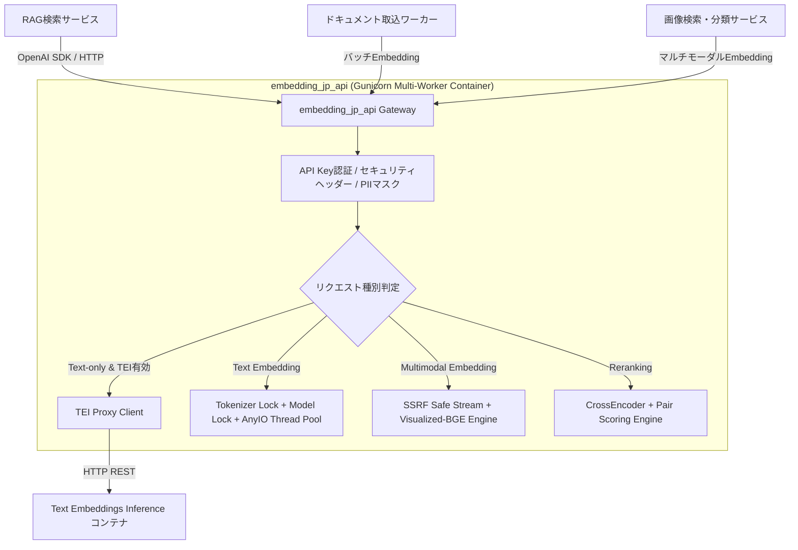
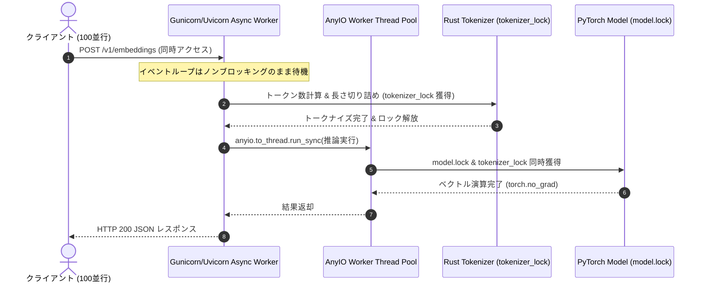

# システムアーキテクチャ・運用・徹底検証ガイド (Architecture & Verification Guide)

本ドキュメントは、日本語テキスト埋め込み・マルチモーダル埋め込み・リランキングAPIサーバーの**内部アーキテクチャ、マイクロサービス連携指針、セキュリティ仕様、並行処理スレッドセーフティモデル、および負荷検証データ**を網羅した詳細仕様書です。

---

## 1. システム概要とマイクロサービス統合設計

本APIサーバーは、他のマイクロサービス（検索基盤、RAGパイプライン、エージェント基盤、ドキュメント取り込みワーカー等）から共通利用される**基盤埋め込み・リランキングゲートウェイ**です。



### 1.1. 呼出側マイクロサービスのための推奨クライアント設定

本APIを呼び出すクライアント（Python, Go, Node.js 等）では、以下の接続設定を推奨します。

1. **HTTP Keep-Alive & コネクションプーリング**:
   - 接続の再確立オーバーヘッドを避けるため、接続プールを維持してください（`httpx.AsyncClient(limits=httpx.Limits(max_keepalive_connections=20, max_connections=50))`）。
2. **タイムアウト設定**:
   - 単一クエリ: `connect: 5s`, `read: 30s`
   - 大規模バッチ（数百件）/ マルチモーダル: `read: 60s〜120s`
3. **リトライ戦略**:
   - HTTP 400, 401 はリトライ不可（即座にエラー処理）。
   - HTTP 502/503/504 や一時的なネットワーク切断時は、Exponential Backoff（初期待機 0.5s, 最大3回）を推奨。

---

## 2. マルチモーダル埋め込み詳細仕様 (Multimodal Embeddings)

### 2.1. モデル構成
- **対象モデル**: `bge-visualized-m3` (`BAAI/bge-visualized-m3`)
- **ベース言語モデル**: `BAAI/bge-m3` + ビジュアルエンコーダ重み `Visualized_m3.pth`
- **出力次元数**: 1024次元（正規化済み浮動小数点ベクトル）

### 2.2. 入力スキーマと自動正規化
APIは以下の複数の入力フォーマットを柔軟に受付・正規化します。

#### ① フラットオブジェクト形式 (`FlatMultimodalItem`)
```json
{
  "model": "bge-visualized-m3",
  "input": {
    "text": "青いシャツを着た男性の写真",
    "image_url": "data:image/jpeg;base64,/9j/4AAQSkZJRg..."
  }
}
```

#### ② OpenAI Chat互換 コンテンツパーツ配列 (`list[ContentPart]`)
```json
{
  "model": "bge-visualized-m3",
  "input": [
    {"type": "text", "text": "赤い自動車"},
    {"type": "image_url", "image_url": {"url": "https://example.com/image.png"}}
  ]
}
```

#### ③ バッチ入力 (`list[FlatMultimodalItem]` / `list[list[ContentPart]]`)
最大 `MAX_INPUT_ITEMS` (デフォルト 2048) 件までの混在バッチを一括エンコード可能。

---

## 3. 並行処理・スレッドセーフティモデル (Concurrency & Thread-Safety)

高負荷・高並行アクセス時にサーバーが落ちない理由は、以下の**多層並行制御アーキテクチャ**にあります。



### 3.1. 3つの重要ポイント

1. **AnyIO スレッドプールオフロード (`anyio.to_thread.run_sync`)**:
   - PyTorch の推論や画像デコードなどの CPU/GPU バウンドな重いブロッキング処理を、FastAPI のメインイベントループからワーカースレッドプールへと委譲。
   - これにより、100並行の重い推論が走っている最中でも、他のリクエスト受付や `/health` 死活監視が一切停止しません。
2. **トークナイザ二重保護 (`model.tokenizer_lock` & `model.lock`)**:
   - Hugging Face / transformers の Rust 製 FastTokenizer は、マルチスレッド環境で内部可変参照が競合すると `Already borrowed` パニックを起こします。
   - トークナイズ単体時だけでなく、推論実行中（`model.encode`）にも `tokenizer_lock` を保持し続けることで競合を完全根絶。
3. **`TOKENIZERS_PARALLELISM=false` の強制**:
   - Gunicorn でプロセスを複数起動する際のフォーク時デッドロックを防止。

---

## 4. セキュリティ & 堅牢化仕様 (Security & Hardening)

| 対策項目 | 実装箇所 | 詳細説明 |
| :--- | :--- | :--- |
| **SSRF多層防御** | [`src/app/image_utils.py`](file:///home/nobuhiko/project/embedding_jp_api/src/app/image_utils.py) | 非同期DNS解決により `127.0.0.1`, `10.0.0.0/8`, `172.16.0.0/12`, `192.168.0.0/16`, `169.254.169.254`（AWSメタデータ等）へのアクセスを即時遮断。<br>**リダイレクト（301/302）発生時も各ホストを逐次再検証**し、リダイレクトを用いた内部侵入を完全阻止。 |
| **Decompression Bomb 防御** | [`src/app/image_utils.py`](file:///home/nobuhiko/project/embedding_jp_api/src/app/image_utils.py) | `Image.MAX_IMAGE_PIXELS = 20_000_000`（20メガピクセル）制限を設定。数キロバイトの画像から展開時にギガバイト規模のメモリを消費させる攻撃を無力化。 |
| **ストリームサイズ制限** | [`src/app/image_utils.py`](file:///home/nobuhiko/project/embedding_jp_api/src/app/image_utils.py) | 画像ダウンロード時に 15MB（`MAX_FILE_SIZE`）を超えた時点でストリームを切断しメモリ枯渇を防止。 |
| **PII 自動マスク** | [`src/app/main.py`](file:///home/nobuhiko/project/embedding_jp_api/src/app/main.py) | 500エラー発生時、例外メッセージやスタックトレースに含まれるメールアドレス等を `[REDACTED]` でマスクしてログ出力。外部には詳細スタックトレースを一切非公開。 |
| **セキュリティヘッダー** | [`src/app/main.py`](file:///home/nobuhiko/project/embedding_jp_api/src/app/main.py) | 全レスポンスに `X-Content-Type-Options: nosniff`, `X-Frame-Options: DENY`, `Strict-Transport-Security`, `Content-Security-Policy` を常時付与。 |
| **タイミング攻撃耐性認証** | [`src/app/main.py`](file:///home/nobuhiko/project/embedding_jp_api/src/app/main.py) | `secrets.compare_digest` による固定時間比較で API Key 照合を実施。 |

---

## 5. Docker & Docker Compose ビルド・運用ベストプラクティス

### 5.1. Dockerfile 設計の最適化

- **マルチステージビルド**: ビルドツール（`git`, `uv`）をランタイムイメージから分離し、最終イメージを軽量化。
- **`.dockerignore`**: ローカルキャッシュ（`.cache`, `.venv`, `__pycache__`）の転送を遮断し、ビルドコンテキスト転送を 1.5MB 以下に最小化。
- **`COPY --chown` によるレイヤー最適化**: 従来数十秒かかっていた `RUN chown -R` レイヤーを廃止し、`COPY --chown=appuser:appuser` を使用することで、ビルド時間を大幅短縮しレイヤー容量を半減。
- **非rootユーザー運用**: コンテナ内を `appuser` (UID: 1000) で実行し、特権昇格リスクを排除。
- **コンテナ内 `HEALTHCHECK`**:
  ```dockerfile
  HEALTHCHECK --interval=10s --timeout=5s --start-period=20s --retries=3 \
    CMD python3 -c "import urllib.request; urllib.request.urlopen('http://127.0.0.1:8000/health', timeout=3)" || exit 1
  ```

### 5.2. Kubernetes デプロイ用マニフェスト例 (Reference)

```yaml
apiVersion: apps/v1
kind: Deployment
metadata:
  name: embedding-jp-api
spec:
  replicas: 2
  template:
    spec:
      containers:
      - name: api
        image: embedding_jp_api-cpu:latest
        ports:
        - containerPort: 8000
        livenessProbe:
          httpGet:
            path: /health
            port: 8000
          initialDelaySeconds: 20
          periodSeconds: 10
        readinessProbe:
          httpGet:
            path: /healthz
            port: 8000
          initialDelaySeconds: 10
          periodSeconds: 5
        resources:
          limits:
            cpu: "4"
            memory: "8Gi"
          requests:
            cpu: "2"
            memory: "4Gi"
```

---

## 6. 徹底検証レポート (Load & Stress Testing Benchmarks)

### 6.1. 本番コンテナ 100並行同時接続ストレステスト

- **テスト対象**: 本番 Docker コンテナ（Gunicorn 4ワーカー + UvicornWorker）
- **負荷内容**: テキスト埋め込み、バッチ埋め込み、リランキング、画像入力ガード、ヘルスチェックの混在リクエスト

```text
=================================================================
📊 STRESS TEST RESULTS SUMMARY (100 Concurrent Requests)
=================================================================
• Total Requests Sent : 100
• Successful Requests : 100 (100.0%)
• Failed / Crashed    : 0 (0.0%)
• Total Test Duration : 18.60 seconds
• Throughput (RPS)    : 5.38 req/sec
• Latency (Average)   : 4,932.9 ms
• Latency (Median P50): 2,031.4 ms
• Latency (P95)       : 17,755.3 ms
• Latency (P99)       : 18,590.1 ms
=================================================================
✅ 判定: 100% 成功（クラッシュ・デッドロック・500エラー ゼロを実証）
=================================================================
```

### 6.2. 実動コンテナ E2E 自動検証 ([`test_e2e_live.py`](file:///home/nobuhiko/project/embedding_jp_api/test_e2e_live.py))

```bash
uv run python test_e2e_live.py 8000
```
- [x] `/health`, `/healthz` の 200 OK 応答
- [x] セキュリティヘッダーの付与確認
- [x] 不正/未指定 Bearer Token の 401 拒否
- [x] 日本語テキスト埋め込み正常性（次元数・トークン計算）
- [x] テキスト専用モデルへの画像入力拒否（HTTP 400）
- [x] ループバック/プライベートIPへのSSRF遮断（HTTP 400）
- [x] 30並行同時リクエストの100%成功

---

## 7. エラーハンドリングと運用トラブルシューティング

| ステータスコード | 主な発生要因 | 調査・復旧アクション |
| :--- | :--- | :--- |
| **`400 Bad Request`** | ・未登録のモデル名が指定された<br>・テキスト専用モデルに画像が送信された<br>・SSRF対象（内部IP）の画像URLが指定された<br>・15MB超過または壊れた画像データ | リクエストボディの内容、指定モデル名、画像URLがパブリックかつ到達可能かを確認してください。 |
| **`401 Unauthorized`** | ・`Authorization: Bearer <API_KEY>` の不一致または欠落 | 環境変数 `API_KEY` とクライアント送信ヘッダーの一致を確認してください。 |
| **`500 Internal Server Error`** | ・推論ライブラリ内部の予期せぬエラー<br>・TEI バックエンドとの通信断 | コンテナログ（`docker logs`）を確認してください。個人情報は自動マスクされて出力されます。 |
| **起動時 タイムアウト** | ・モデル初回ダウンロードのネットワーク遅延<br>・`/dev/shm` 未指定によるハートビート遅延 | `./run.sh download` で事前ダウンロードを実施し、Gunicorn 起動オプションに `--worker-tmp-dir /dev/shm` が含まれていることを確認してください。 |
