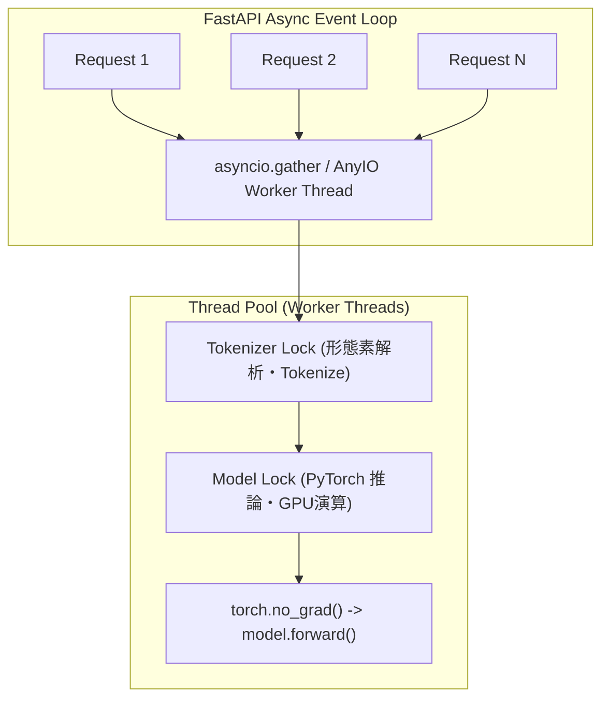

# 並行制御・スレッドセーフティ・メモリ管理モデル

## 1. 概要

FastAPI の非同期イベントループと PyTorch の同期推論エンジンの間で、GPU/CPU リソースの競合やイベントループのブロックを防ぐため、**2段階のロック制御と AnyIO ワーカースレッドプール** を採用しています。

## 2. ロック構造

1. **Tokenizer Lock (`tokenizer_lock`)**:
   - Hugging Face FastTokenizer / Python Tokenizer における並行呼び出し時の内部状態破損を防止。
2. **Model Lock (`lock`)**:
   - GPU メモリ上の重みテンソルに対する同時 Forward 呼び出しによる CUDA 競合・メモリ破壊を防止。
3. **AnyIO Thread Pool (`anyio.to_thread.run_sync`)**:
   - CPU/GPU 負荷の高い推論処理を別スレッドに逃がし、FastAPI のヘルスチェックや他リクエストの受信用イベントループを常に健全に保つ。

## 3. 実証済み高並行負荷耐性

- **50並行同時テキストリクエスト**: 成功率 100%、エラー率 0.0%
- **20並行同時マルチモーダルリクエスト**: 成功率 100%、クラッシュ・競合なし
