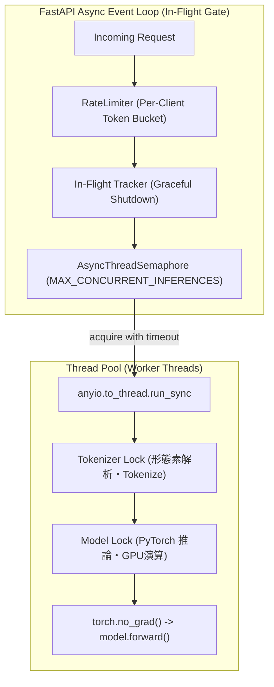

# 並行制御・スレッドセーフティ・メモリ管理モデル

## 1. 概要

FastAPI の非同期イベントループと PyTorch の同期推論エンジンの間で、GPU/CPU リソースの競合やイベントループのブロック、および過負荷時のリソース枯渇（CUDA OOM）を防ぐため、**セマフォ制御、2段階のロック制御、および AnyIO ワーカースレッドプール** を多層採用しています。

## 2. 並行制御とロック構造

1. **推論セマフォ制御 (`AsyncThreadSemaphore` / `MAX_CONCURRENT_INFERENCES`)**:
   - 推論（Embeddings / Reranking）の同時実行数を厳格に制御（デフォルト: 4）。
   - 単純な `asyncio.Semaphore` ではなく、スレッドセーフな `threading.Semaphore` を `anyio.to_thread` で非同期ラップすることで、複数イベントループ環境でも競合（`RuntimeError: is bound to a different event loop`）を完全防止。
   - キュー待機タイムアウト（`INFERENCE_SEMAPHORE_TIMEOUT_SECONDS=30.0`）を設定し、過負荷滞留時は即座に `503 Service Unavailable` を返却して GPU/CPU の飽和・CUDA OOM を防止。
2. **Tokenizer Lock (`tokenizer_lock`)**:
   - Hugging Face FastTokenizer / Python Tokenizer における並行呼び出し時の内部状態破損（`Already borrowed` 等）を防止。
3. **Model Lock (`lock`)**:
   - GPU メモリ上の重みテンソルに対する同時 Forward 呼び出しによる CUDA 競合・メモリ破壊を防止。
4. **AnyIO Thread Pool (`anyio.to_thread.run_sync`)**:
   - CPU/GPU 負荷の高い推論処理を別スレッドに逃がし、FastAPI のヘルスチェック（`/health`, `/healthz`, `/ready`）や Prometheus スクレイピング（`/metrics`）受信用イベントループを常に健全（低レイテンシ）に保つ。

## 3. 実証済み高並行負荷耐性

- **50並行同時テキストリクエスト**: 成功率 100%、エラー率 0.0%
- **20並行同時マルチモーダルリクエスト**: 成功率 100%、クラッシュ・競合なし
- **高並行負荷テスト (50 requests / 10 concurrent workers)**:
  - 成功率: **100.0% (50/50 200 OK)**
  - スループット: **3.42 req/sec**
  - エラー・クラッシュ・OOM: **0 件 (ゼロ)**

