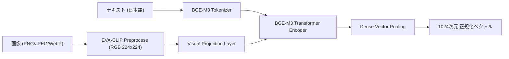

# マルチモーダル埋め込み推論アーキテクチャ

## 1. 概要

`bge-visualized-m3` をバックエンドとし、画像（図面、グラフ、UIモック、スケッチ等）とテキスト（キャプション、注記、検索クエリ）を同一の **1024次元空間** に埋め込む機能を提供します。



## 2. 入力スキーマと自動正規化

API は以下の形式を受け付け、内部で `(Optional[str], Optional[PIL.Image])` に自動正規化します。

1. **フラット形式 (`FlatMultimodalItem`)**:
   ```json
   {
     "model": "bge-visualized-m3",
     "input": {
       "text": "API Gateway と DB のシステム構成図",
       "image_url": "data:image/png;base64,..."
     }
   }
   ```
2. **OpenAI ContentPart 形式**:
   ```json
   {
     "model": "bge-visualized-m3",
     "input": [
       {"type": "text", "text": "認証フローチャート"},
       {"type": "image_url", "image_url": {"url": "data:image/png;base64,..."}}
     ]
   }
   ```
3. **画像単体（テキスト省略 / 空文字）**:
   - `text: ""` または `text: null` の場合、テキストを `None` として扱い純粋な画像エンコードを実行。
4. **バッチ形式**:
   - 上記アイテムの配列を渡すことで、複数アイテムを一括処理。

## 3. エッジケースと堅牢化

- **透過 PNG (RGBA)**: PIL にてアルファチャンネルを破棄し `RGB` へ安全に変換。
- **超長文テキスト**: トークン切り詰めにより最大長制約を遵守。
- **テキスト専用モデルへの誤送信ガード**: `cl-nagoya/ruri-v3-310m` 等に画像が送信された場合、400 Bad Request で明示的に拒絶。
