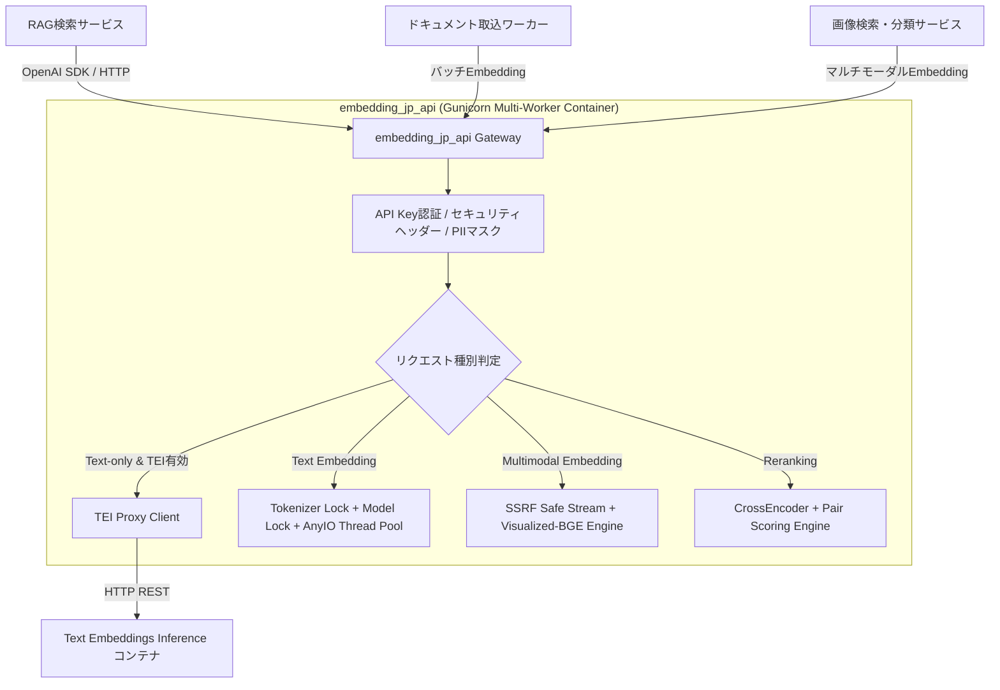

# システム全体アーキテクチャ・マイクロサービス統合設計

## 1. 概要

本APIサーバーは、他のマイクロサービス（検索基盤、RAGパイプライン、エージェント基盤、ドキュメント取り込みワーカー等）から共通利用される**基盤埋め込み・リランキングゲートウェイ**です。

## 2. セキュリティ多層防御

1. **API Key 認証**: `Authorization: Bearer <API_KEY>` による定数時間比較 (`secrets.compare_digest`)。
2. **SSRF 防御 (Server-Side Request Forgery)**: 非同期 DNS 解決により、プライベート IP / ループバック / リンクローカルへの画像ダウンロードを遮断。
3. **セキュリティヘッダー**: `nosniff`, `DENY`, `max-age=31536000`, `Content-Security-Policy` をすべてのレスポンスに付与。
4. **PII マスキング**: ログ出力時に API キーや機密情報を自動マスキング。

## 3. クライアント接続の推奨設定

- **HTTP Keep-Alive**: コネクション再確立のオーバーヘッドを防ぐため接続プールを維持。
- **タイムアウト**:
  - テキスト推論: `connect: 5s`, `read: 30s`
  - 大規模バッチ / マルチモーダル: `read: 60s〜120s`
- **リトライ**: HTTP 502/503/504 等の一時障害時のみ Exponential Backoff（初期待機 0.5s、最大3回）を推奨。
