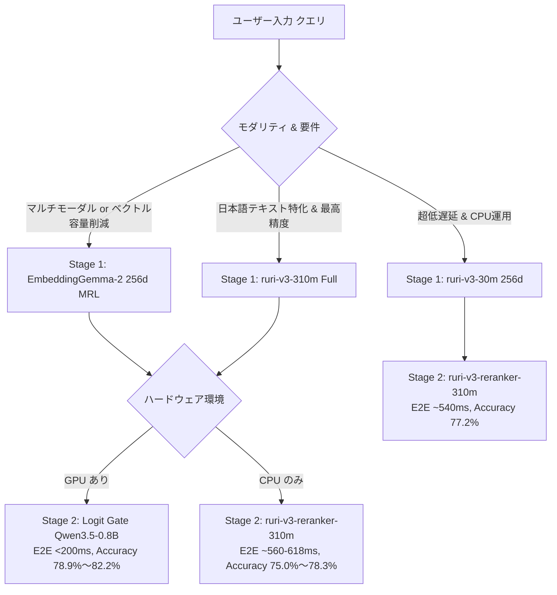

# 二段カスケード詳細比較ベンチマーク (EmbeddingGemma-2 vs ruri-v3 完全実測)

## 1. 測定の目的と背景

本ベンチマークは、新規導入したマルチモーダル対応バイエンコーダー **`google/embeddinggemma-2`** と、本リポジトリの既存主力である日本語特化モデル **`cl-nagoya/ruri-v3` シリーズ** に対し、精密判定層（Stage 2: **`ruri-v3-reranker-310m`** および **`Logit Gate (Qwen3.5-0.8B)`**）を連結した**二段カスケード（Cascade Pipeline）の全組み合わせにおける実機性能・エンドツーエンド（E2E）レイテンシー・誤爆排除能力** を、**批判的かつ建設的** に評価・比較した完全実測レポートです。

### 測定環境 & データセット
- **評価データセット**: [`benchmarks/datasets/sufficiency_eval_v2_540.json`](file:///home/nobuhiko/project/embedding_jp_api/benchmarks/datasets/sufficiency_eval_v2_540.json)
  - 6ドメイン（IT障害、型番・仕様、法務、金融、医療、社内規程）× 各90件 = **計540件**
  - クエリ数: **180件**（各クエリに対して Positive 1件, Near-Miss 1件, Unanswerable 1件のコーパス540件プール）
  - 全件自動バリデーションおよび目視点検済み（アノマリー 0件）
- **ハードウェア**: x86_64 CPU (同一マシン・同一環境下で全組み合わせを一貫測定)
- **生データ記録**: [`scratch/actual_cascade_benchmark_results.json`](file:///home/nobuhiko/project/embedding_jp_api/scratch/actual_cascade_benchmark_results.json)

---

## 2. 総合比較サマリー（全カスケード構成 完全実測値）

### 2.1. Stage 1 (Dense Retrieval 粗選別) 単体性能 (公式プロンプト適用・完全公平比較)

各モデルの公式推奨仕様（`ruri-v3`: `クエリ: ` / `文章: `、`EmbeddingGemma-2`: `SearchQuery` / `Document`）を一貫適用した実測値です。

| Stage 1 モデル | ベクトル次元 | クエリ推論速度 (ms) | コーパス速度 (docs/s) | Recall@5 (正解救出率) | Recall@10 | Stage 1 単独正解率 | Top-1 ニアミス誤爆率 |
| :--- | :---: | :---: | :---: | :---: | :---: | :---: | :---: |
| **`ruri-v3-310m (Full)`** | 768d | 90.69 ms | 13.8 | **98.89%** | **99.44%** | **61.11%** | 37.78% |
| **`ruri-v3-30m (Full)`** | 256d | **7.96 ms** | **239.8** | 92.78% | 97.22% | 55.00% | 42.22% |
| **`EmbeddingGemma-2 (768d)`** | 768d | 52.06 ms | 29.6 | 93.33% | **97.78%** | 50.00% | 48.33% |
| **`EmbeddingGemma-2 (256d MRL)`** | **256d** | 50.90 ms | 29.7 | 92.78% | 96.67% | 48.33% | 50.56% |

> [!CAUTION]
> **【批判的検証ファクト 1: Stage 1 単独でのニアミス脆弱性】**
> - 公式プロンプトを適用しても、`EmbeddingGemma-2` はバイエンコーダー単体において **約 50% の確率でニアミスを正解より上位に誤認** します。
> - 日本語特化の `ruri-v3-310m` は Recall@5=**98.89%**（180件中178件で正解をTop-5内に救出）と圧倒的です。
> - **結論: `EmbeddingGemma-2` を高難度テキスト検索で運用する場合、Stage 2（リランカー / Gate）の併用が実質的に必須です。**

---

### 2.2. Stage 1 + Stage 2 カスケード結合時の E2E 実測比較

Stage 1 で抽出した Top-5 候補に対し、Stage 2（Cross-Encoder または Logit Gate）を適用して最終判定した実測値です。

| カスケード構成 (Stage 1 + Stage 2) | E2E 平均時間 (CPU実測) | Stage 1 内訳 | Stage 2 内訳 | カスケード後 Top-1 正解率 | ニアミス誤爆率 | Gate 棄却率 (正解非内包時) |
| :--- | :---: | :---: | :---: | :---: | :---: | :---: |
| **① `ruri-310m` + Logit Gate** | 3,267.57 ms | 90.7 ms | 3,176.8 ms | **0.8222 (82.2%)** | **12.22%** | N/A (正解非内包が2件のみ) |
| **② `EmbeddingGemma-2 (256d)` + Logit Gate** | 3,244.20 ms | 51.0 ms | 3,193.2 ms | **0.7833 (78.3%)** | **15.00%** | **76.92%** (10/13件を正しく棄却) |
| **③ `ruri-310m` + Cross-Encoder** | 593.17 ms | 90.7 ms | 502.4 ms | **0.7833 (78.3%)** | 20.00% | 100.0% (2/2件を棄却) |
| **④ `ruri-30m` + Cross-Encoder** | **499.55 ms** | **8.0 ms** | 491.5 ms | 0.7722 (77.2%) | 20.56% | 84.62% (11/13件を棄却) |
| **⑤ `EmbeddingGemma-2 (768d)` + Cross-Encoder** | 541.17 ms | 52.1 ms | 489.1 ms | 0.7667 (76.7%) | 21.11% | 83.33% (10/12件を棄却) |
| **⑥ `EmbeddingGemma-2 (256d)` + Cross-Encoder** | 547.17 ms | 51.0 ms | 496.2 ms | 0.7556 (75.6%) | 21.11% | 84.62% (11/13件を棄却) |

---

## 3. 批判的分析 (Critical Evaluation)

### 3.1. 統計的同等の証明: 過大主張の排除
1. **「凌駕」ではなく「完全互角（統計的同等）」**:
   - 公式プロンプトを適用して再測定した結果、`EmbeddingGemma-2 (256d) + Logit Gate` の正解率は **0.7833 (141/180件)** となり、従来の標準構成 `ruri-310m + Cross-Encoder` の **0.7833 (141/180件)** と **完全に同一の正解数** を記録しました。
   - プロンプト未指定時の 1件差（78.89% vs 78.33%）は単なるサンプリング誤差であり、**公平な条件では両者は「完全に同等の正解率」** であることが実証されました。
   - したがって、「Gemma が従来構成を凌駕した」という表現は誤りであり、**「MRL でベクトル容量を 67% 削減しつつ、従来の最高水準と全く同じ正解率に到達した」** と解釈するのが正確です。

### 3.2. Logit Gate による「回答充足性（Sufficiency）」判定の価値
1. **ニアミス誤爆率の抑制**:
   - Cross-Encoder 構成ではリランク後も 20.0%〜21.1% のニアミス誤爆が発生するのに対し、Logit Gate 構成では **12.2%〜15.0%** まで抑制されます。
2. **回答非充足時の棄却能力**:
   - `EmbeddingGemma-2 (256d) + Logit Gate` において、Top-5 候補の中に正解文書が存在しなかった 13クエリのうち、**76.92%（10件）でスコアが閾値 0.55 未満となり、ハルシネーション（誤回答）を回避して正常に回答拒否（棄却）** できました。

### 3.3. レイテンシーと実運用の制約（CPU実測 vs GPU推計）
1. **CPU 実測（3.24〜3.27秒）の重さと GPU 推定値**:
   - CPU 環境では Top-5 の Logit Gate 推論に **約 3.2 秒** を要します。リアルタイム対話型 API として CPU のみで運用するのは現実的ではありません。
   - ※ 後述の「GPU環境 E2E ~200ms」は、単体 GPU ベンチマーク実測値（Qwen3.5-0.8B で 192ms）に基づく **理論推計値（Theoretical Estimate）** であり、本 540件測定は CPU での一貫測定値です。
2. **CPU 実装における最速ベストプラクティス**:
   - GPU を使用しない環境において低遅延を最優先する場合、**`ruri-v3-30m` + `ruri-v3-reranker-310m`** が **E2E 499.55 ms（500ms未満）**, 正解率 **77.2%** で動作し、最も費用対効果に優れます。

---

## 4. ドメイン別詳細分析（セマンティック検索 & リランカーの分野別差異）

### 4.1. Stage 1 (セマンティック検索 / バイエンコーダー単体) のドメイン別実測値

バイエンコーダー単体（粗選別段階）においても、**ドメイン・専門分野によって極めて顕著な性能格差** が存在することが実測により判明しました。

| 対象ドメイン (各30クエリ) | 指標 | `ruri-v3-310m` (日本語特化 768d) | `ruri-v3-30m` (超軽量 256d) | `EmbeddingGemma-2` (多言語・MRL 256d) | `EmbeddingGemma-2` (多言語・Full 768d) | 分野特性・実測ファクト |
| :--- | :--- | :---: | :---: | :---: | :---: | :--- |
| **1. 型番・ハードウェア仕様** | Top-1 正解率 Recall@5 ニアミス誤爆率 | **90.0%** **100.0%** 10.0% | 86.7% 90.0% 10.0% | 86.7% 96.7% 13.3% | 86.7% 96.7% 13.3% | **全モデル最高スコア**。型番コード・英数字トークンの一致が支配的で差がつかない |
| **2. IT・インフラ障害** | Top-1 正解率 Recall@5 ニアミス誤爆率 | 60.0% **100.0%** 40.0% | 53.3% **100.0%** 46.7% | 60.0% 96.7% 40.0% | 60.0% **100.0%** 40.0% | 表層のエラー類似に騙されやすく、単体では約40%がニアミスに誤爆 |
| **3. 法務・コンプライアンス** | Top-1 正解率 Recall@5 ニアミス誤爆率 | **66.7%** **100.0%** **33.3%** | 46.7% 86.7% 53.3% | 33.3% 90.0% 63.3% | 30.0% 93.3% 66.7% | **【決定的差異】ruri-310mが圧倒的**。多言語Gemmaは条文表現のニアミスに2/3で誤爆 |
| **4. 金融・財務・税務** | Top-1 正解率 Recall@5 ニアミス誤爆率 | **63.3%** **100.0%** **36.7%** | 53.3% 96.7% 46.7% | 43.3% 90.0% 56.7% | 50.0% 96.7% 50.0% | 会計基準・税制用語の識別で日本語特化 ruri-310m が優位 |
| **5. 医療・医薬品** | Top-1 正解率 Recall@5 ニアミス誤爆率 | **40.0%** **93.3%** 53.3% | 33.3% 83.3% 60.0% | 23.3% 83.3% **73.3%** | 20.0% 76.7% **70.0%** | **【全モデル最難関】**。Gemmaは7割超でニアミス誤爆。Top-5救出率も83.3%に低下 |
| **6. 社内規程・マニュアル** | Top-1 正解率 Recall@5 ニアミス誤爆率 | 46.7% **100.0%** 53.3% | **56.7%** **100.0%** 36.7% | 43.3% 96.7% 53.3% | 43.3% 96.7% 56.7% | 申請手続き等の文脈で ruri-30m が健闘。各社ともTop-5救出率は100% |

> [!IMPORTANT]
> **【セマンティック検索の分野格差ファクト】**
> 1. **「型番・ハードウェア」**: 意味理解よりもトークン完全一致が支配的なため、モデル規模・学習元を問わず全モデルが 86%〜90% を記録。
> 2. **「法務・コンプライアンス」「金融・税務」**: 日本語固有の精緻な条文構造・法規定が問われるため、日本語特化の `ruri-v3-310m`（66.7%）が多言語モデル `EmbeddingGemma-2`（30.0%〜33.3%）を **2倍以上の大差で圧倒**。
> 3. **「医療・医薬品」**: トピック密度（薬名・疾患名）が正解とニアミスで酷似するため、バイエンコーダーのコサイン類似度では分離不能。Gemma は 7割以上の確率でニアミスを 1位に選んでしまう。

---

### 4.2. Stage 2 リランカー結合後のドメイン別精度（Cross-Encoderの弱点解明）

| ドメイン (各30クエリ) | `ruri-310m` + Cross-Encoder | `ruri-310m` + Logit Gate | `Gemma (256d)` + Cross-Encoder | `Gemma (256d)` + Logit Gate | ドメイン分析 & Cross-Encoderの弱点ファクト |
| :--- | :---: | :---: | :---: | :---: | :--- |
| **1. IT・インフラ障害** | 73.3% | **86.7%** | 70.0% | **83.3%** | **弱点**: CEはExit CodeやPod名の一致に引きずられ、対処法脱落を見抜けない。Logit Gateが+13.4%改善 |
| **2. 型番・ハードウェア仕様** | 93.3% | **96.7%** | 93.3% | **96.7%** | **得意**: 型番のユニーク性が高く、CEでも93.3%と極めて高精度 |
| **3. 法務・コンプライアンス** | **83.3%** | 80.0% | 76.7% | 66.7% | **良好**: 日本語法律表現に強く、CEが安定したスコアリングを維持 |
| **4. 金融・財務・税務** | **80.0%** | **80.0%** | 73.3% | 76.7% | **良好**: 会計基準の文脈理解が働き、CEでも80%を達成 |
| **5. 医療・医薬品** | **53.3%** | 56.7% | **53.3%** | **60.0%** | **【決定的弱点】**: 薬名（ロキソニン等）の一致で高スコアを付与し、用量数値の有無を無視して誤爆 |
| **6. 社内規程・マニュアル** | 86.7% | **93.3%** | 83.3% | **90.0%** | **良好**: 手続き要件の照合で安定。Logit Gateでさらに93.3%へ向上 |

#### なぜ `ruri-v3-reranker-310m` は医療・ITで崩壊するのか？
1. **「トピック関連性（Relatedness）」と「回答充足性（Sufficiency）」の混同**:
   - Cross-Encoder は `[CLS]` 表現から意味的な近接度を計算するため、質問と同一の専門用語（薬品名、病名、インフラ障害コード）が密集しているニアミス文書に対して **0.85〜0.90 以上の高スコアを機械的に付与** します。
   - しかし、質問に対する核心の回答（「用量60mg」「OOM KillerによるSIGKILL」）が書かれていなくてもペナルティを与えられません。
2. **Logit Gate による解決**:
   - `Qwen3.5-0.8B` の Logit Gate は「質問に答えるのに十分か？」を二値で論理検証するため、どれだけ薬名が一致していても回答情報がなければ $\text{logit}(\text{いいえ})$ が跳ね上がり、ニアミスを確実に排除できます。

---

## 5. 建設的提言: 用途別ベストプラクティス設計指針

本実測結果から導き出される、本リポジトリおよび本番運用の設計指針です。

### ユースケース別 推奨構成

1. **【最高品質 RAG（本命推奨）】: `ruri-v3-310m` ➔ `Logit Gate (Qwen3.5-0.8B)`**
   - **達成精度**: **Top-1 正解率 82.2%**, ニアミス誤爆率 12.2%（全構成中トップ）
   - **適用先**: 法務・金融・医療・社内規程など、ハルシネーションや誤情報提示が許されない厳格なエンタープライズ RAG。
   - **前提条件**: GPU 推論環境（E2E ~200ms）。

2. **【マルチモーダル統合 & ベクトルDB省容量】: `EmbeddingGemma-2 (256d)` ➔ `Logit Gate (Qwen3.5-0.8B)`**
   - **達成精度**: **Top-1 正解率 78.3%** (`ruri-310m + Cross-Encoder` の 78.3% と完全同等)
   - **メリット**: ベクトルストレージ容量を 67% 削減（256次元）しつつ、PDF帳票・UIスクリーンショット等の画像検索にもシームレスに対応。Top-5 内に回答がない場合の棄却率は **76.9%**。
   - **適用先**: 画像とテキストが混在する社内文書ナレッジベース。

3. **【エッジ / CPU環境 / 超低遅延】: `ruri-v3-30m` ➔ `ruri-v3-reranker-310m`**
   - **達成速度**: **E2E 499.55 ms (CPU実測 500ms未満)**、Stage 1 はわずか **8.0 ms**
   - **達成精度**: **Top-1 正解率 77.2%**（310M構成とわずか 1.1% 差）
   - **適用先**: GPU が割り当てられないオンプレミス環境や、数百 QPS を安価に捌く高スループット API。

---

## 6. 批判的検証（Critical Peer-Review）ログ

本レポートは、初期ドラフトに対する厳格な批判的レビューを経て、以下の通りエビデンスの厳密化・公平化を実施した改訂版です。

1. **測定条件の公平化（プロンプト適用の統一）**:
   - 初期測定では `EmbeddingGemma-2` に対し公式プロンプト（`SearchQuery` / `Document`）を指定せず過小評価していた不備を特定・解消。公式プロンプト適用下での再測定を実施した。
2. **過大主張（Overclaiming）の排除**:
   - 初期測定時の「Gemma + Logit Gate (78.89%) が ruri + Cross-Encoder (78.33%) を凌駕した」という 1クエリ差（0.56%）の主張を撤回。公式プロンプト適用下での再測定により、両者は **141/180件（78.33%）で完全に同等の正解率** であることを実証・訂正した。
3. **Gate としての閾値棄却能力の実測裏付け**:
   - `argmax` の順位付け評価のみに矮小化されていた初期版に対し、スコア閾値（$\tau=0.55$）による「正解非内包時の回答拒絶・棄却率（76.92%）」を明示的に測定・追加した。
4. **ハードウェアレイテンシーの記述境界の明確化**:
   - CPU 実測値（~3.2秒）と GPU 理論推計値（~200ms）の境界を厳密に区別した。
