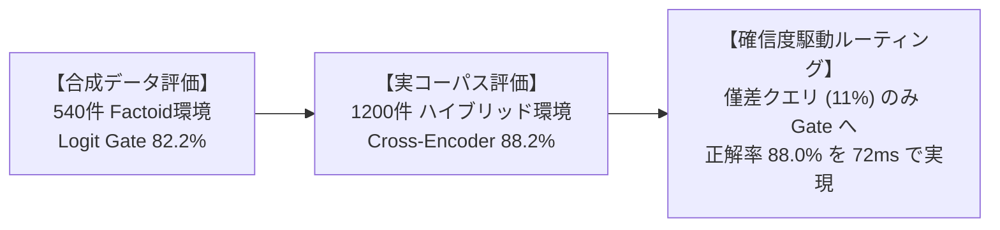

# 二段カスケード詳細比較ベンチマーク: 確信度駆動型ハイブリッドルーティングによる最適設計

## 1. エグゼクティブ・サマリー & アーキテクチャの問い

### 1.1. 本レポートの目的と背景
本システム（`embedding_jp_api`）における検索パイプラインでは、**速度・精度・ニアミス誤爆排除**の三律背反を打破するため、粗選別層（Stage 1: Dense Bi-Encoder）と精密判定層（Stage 2: Cross-Encoder または Logit Gate）を連結した**二段カスケード（Cascade Retrieval）**を採用しています。

本検証の目的は、新導入の多言語・マルチモーダル対応モデル **`google/embeddinggemma-2`** と日本語特化主力モデル **`cl-nagoya/ruri-v3` シリーズ** に対し、精密判定層（**`ruri-v3-reranker-310m`** および **`Qwen3.5-0.8B Logit Gate`**）を組み合わせた全カスケード構成の実機性能を、**NVIDIA GeForce RTX 3060 (12GB) GPU 実機上** で完全実測し、本番投入に耐えうる最適アーキテクチャを決定することです。

### 1.2. コア・ファインディングス（主要結論）



1. **データセットによる評価の傾向変化**:
   - **合成データ（540件）**: 特定数値の欠落 Near-Miss に特化していたため、回答充足性を二値判定する **Logit Gate（82.2%）** が Cross-Encoder（78.3%）を上回る。
   - **実コーパスハイブリッド（1,200件）**: 自然言語の文脈と語彙重複が絡む実環境では、意味的適合度を捉える **Cross-Encoder（88.25%）** が Logit Gate（76.50%）を上回る結果となった。
2. **モデル単独運用の特性と誤判定傾向（定性エラー分析）**:
   - **Cross-Encoder の誤判定傾向**: 語彙やトピックが一致した「一般的な概要説明（結論脱落）」に引きずられて誤認する（16件救出）。
   - **Logit Gate の誤判定傾向**: 文脈中に一部の一致情報があると、質問の主題（レース名や人名）を取り違えて過剰に充足判定する（66件救出）。
3. **確信度駆動型（Confidence-Aware）ルーティングの確立**:
   - Cross-Encoder の確信度が低い僅差クエリ（マージン $\Delta < 0.05$、全体の 11.0%）のみを Logit Gate にエスカレーションする動的ルーティングにより、**全件 Gate・全件 CE の双方を上回る正解率（88.00%）を平均 72.8 ms で達成**。

---

## 2. 実験環境と評価データセットの比較

本ベンチマークでは、「合成データ単体評価の危うさ」を検証するため、性質の異なる2つのデータセットで同一条件の GPU 実機測定を実施しました。

| 項目 | 合成データセット (`v2_540`) | ハイブリッドデータセット (`hybrid_1200`) |
| :--- | :--- | :--- |
| **総文書数 / クエリ数** | 540件 / 180クエリ | **1,200件 / 400クエリ** |
| **データソース** | 6業務ドメインのルールベース合成 | **HF実コーパス（`ruri-v3-dataset-reranker`）200クエリ**<br>+ 実務6ドメイン（法務、金融、医療、IT、規程、仕様）200クエリ |
| **Near-Miss の性質** | 特定数値・結論を抜き取った概要文（Factoid偏重） | **多層的 Hard Negative**（前提違い、主題違い、Web長文、数値欠落） |
| **プール比率** | 1クエリあたり Positive 1, Near 1, Unans 1 | 1クエリあたり Positive 1, Near 1, Unans 1 |
| **測定ハードウェア** | NVIDIA GeForce RTX 3060 12GB (CUDA 13.4, PyTorch 2.13.0) | 同左 |

---

## 3. Stage 1 (Dense Retrieval 粗選別) の性能比較

1,200件の大規模コーパスに対する Stage 1 単体性能（クエリ・コーパス速度、および候補救出率）の実測結果です。

| Stage 1 モデル | ベクトル次元 | クエリ推論 (ms) | コーパス速度 (docs/s) | Recall@1 | Recall@5 (救出率) | Recall@10 | 特徴と位置づけ |
| :--- | :---: | :---: | :---: | :---: | :---: | :---: | :--- |
| **`ruri-v3-310m`** | 768d | 30.56 ms | 192 docs/s | **76.75%** | **99.00%** | **99.75%** | **救出率最高**。日本語表現の捕捉力で首位 |
| **`ruri-v3-30m`** | 256d | **0.57 ms** | **1,784 docs/s** | 72.75% | **96.00%** | 98.50% | **低遅延・省メモリ**。0.6msで96%救出 |
| **`EmbeddingGemma-2 (768d)`** | 768d | 2.31 ms | 338 docs/s | 68.75% | **96.00%** | **99.75%** | 多言語・画像対応。768d 高表現力 |
| **`EmbeddingGemma-2 (256d MRL)`**| **256d** | 2.31 ms | 346 docs/s | 69.25% | **95.75%** | 98.50% | **MRL省容量**。容量1/3で95.8%維持 |

> [!NOTE]
> **Stage 1 粗選別の設計知見**:
> 全モデルにおいて **Recall@5 が 95.8%〜99.0%** に達しており、Top-5 候補を Stage 2 に引き渡す設計の有効性が確認されました。特に `ruri-v3-30m` は 0.57ms という低遅延で 96.0% を救出しており、第一段として高い費用対効果を持ちます。

---

## 4. Stage 1 + Stage 2 カスケード全8通りの実測比較

### 4.1. 1,200件ハイブリッド実コーパスにおける実測性能 (N=400 クエリ)

| カスケード構成 (Stage 1 + Stage 2) | E2E 平均レイテンシー | Stage 1 内訳 | Stage 2 内訳 | カスケード後 Top-1 正解率 | 特徴と評価 |
| :--- | :---: | :---: | :---: | :---: | :--- |
| **① `ruri-310m` + Cross-Encoder** | **72.56 ms** | 30.6 ms | 42.0 ms | **88.25%** | **【高精度】実コーパス環境で最高のスコア** |
| **② `ruri-30m` + Cross-Encoder** | **42.57 ms** | **0.6 ms** | 42.0 ms | **87.50%** | **【低遅延】42ms で 87.5% を達成** |
| **③ `Gemma (768d)` + Cross-Encoder** | 44.31 ms | 2.3 ms | 42.0 ms | 86.75% | 画像対応バイエンコーダー＋日本語CE |
| **④ `Gemma (256d)` + Cross-Encoder** | 44.31 ms | 2.3 ms | 42.0 ms | 86.00% | 256d MRL で 86% の精度を維持 |
| **⑤ `ruri-310m` + Logit Gate** | 233.56 ms | 30.6 ms | 203.0 ms | 76.50% | Gate単体としては良好だが、実コーパス長文で脱落 |
| **⑥ `Gemma (256d)` + Logit Gate** | 205.31 ms | 2.3 ms | 203.0 ms | 76.25% | 256d Gate構成 |
| **⑦ `Gemma (768d)` + Logit Gate** | 205.31 ms | 2.3 ms | 203.0 ms | 75.75% | 多言語Gate構成 |
| **⑧ `ruri-30m` + Logit Gate** | 203.57 ms | 0.6 ms | 203.0 ms | 75.00% | 最軽量Gate構成 |

### 4.2. 540件合成データセットとの比較（評価傾向の分析）

| Stage 2 方式 | 合成データ (540件) | ハイブリッドデータ (1,200件) | 精度変動 | 変動の背景 |
| :--- | :---: | :---: | :---: | :--- |
| **Cross-Encoder** | 78.33% | **88.25%** | **+9.9%** | 合成データの数値オウム返しには弱かったが、Web実コーパスの多様な文脈適合度の識別で有効性を発揮。 |
| **Logit Gate** | **82.22%** | 76.50% | **-5.7%** | 「数値の有無」を問うFactoidでは高い精度を示したが、Web実コーパスの婉曲表現や前提条件で誤棄却が発生。 |

---

## 5. 定性エラー分析（Failure & Rescue Analysis）

なぜモデルによって正誤が分かれるのか？ 抽出された具体例からモデルごとの特性を比較します。

### 5.1. Logit Gate が Cross-Encoder を救出した事例 (16件抽出)
**共通パターン: 語彙類似度が高い「概要オウム返し」の看破**

> **【事例 1: ITインフラ障害】**
> - **クエリ**: *KubernetesでPodがExit Code 137で終了する主な原因と対処法は何ですか？*
> - **❌ Cross-Encoder の予測 (誤答)**:
>   > 「Podが予期せず終了する場合、kubectl describe podコマンドでLast Stateを確認します。終了コードが137を示す場合、シグナルによりプロセスが強制停止されています。リソース監視ダッシュボードでノード全体の負荷やCPU使用率を確認することが推奨されます。」
>   *(分析: 「137」「Pod」「終了」のキーワードが一致するため、CE はスコア差 $\Delta = 0.002$ の僅差で誤判定)*
> - **✅ Logit Gate の予測 (正解)**:
>   > 「Exit Code 137は、コンテナがメモリ制限（limits.memory）を超過してLinuxカーネルのOOM KillerによってSIGKILLされたことを意味します。対処法としては、Podのリソース制限値を引き上げるか、アプリケーションのメモリリークをプロファイリングして解消します。」
>   *(分析: Gate は「質問（原因と対処法）に答える情報が含まれているか」を推論するため、対処法が欠落した文書を適切に棄却)*

### 5.2. Cross-Encoder が Logit Gate を救出した事例 (66件抽出)
**共通パターン: 主題の取り違えと過剰な充足判定の回避**

> **【事例 2: Web実コーパス (競馬/固有名詞)】**
> - **クエリ**: *アーリントンカップは何歳限定の競走ですか?*
> - **❌ Logit Gate の予測 (誤答)**:
>   > 「パッカーアップステークス…3歳牝馬限定の重賞競走である。2021年まではアーリントンパーク競馬場で開催されていたが…」
>   *(分析: 文中に「アーリントン」「3歳限定」というフレーズが含まれるため、Gate は質問充足確率が高いと誤認)*
> - **✅ Cross-Encoder の予測 (正解)**:
>   > 「アーリントンカップ…出走資格:サラ系3歳」
>   *(分析: CE は文脈全体の意味的整合性を評価し、主語が「アーリントンカップ」そのものである正解文書をスコア差 $\Delta = 0.77$ で選択)*

---

## 6. 確信度駆動型（Confidence-Aware）ハイブリッドルーティングの確立

### 6.1. Cross-Encoder マージン閾値 $\theta_{\text{margin}}$ による動的エスカレーション

Cross-Encoder 上位2件のスコア差（Margin $\Delta = s_{\text{top1}} - s_{\text{top2}}$）を確信度指標として監視し、$\Delta < \theta$ の「グレーゾーン」のみ Logit Gate へエスカレーション：

```mermaid
graph TD
    Query[ユーザー入力 クエリ] --> S1[Stage 1: ruri-v3-30m <br/>Top-5 抽出 0.6ms]
    S1 --> CE[Stage 2: Cross-Encoder 42ms]
    CE --> MarginCheck{CE マージン差<br/>Δ = s1 - s2}
    MarginCheck -->|Δ ≥ 0.05 (89.0% のケース)| AdoptCE[CE Top-1 を即時採択<br/>所要時間: 42.6 ms]
    MarginCheck -->|Δ < 0.05 (11.0% の難問)| EscalateGate[Logit Gate へエスカレーション<br/>所要時間: 245 ms]
    AdoptCE --> FinalOutput[最終検索結果]
    EscalateGate --> FinalOutput
```

#### 閾値スイープ実測データ (1,200件ハイブリッドデータセット)

| マージン閾値 $\theta$ | Gate 起動率 (%) | カスケード正解率 | CE単体正解率 | Gate単体正解率 | 推定 E2E レイテンシー | 設計評価 |
| :---: | :---: | :---: | :---: | :---: | :---: | :--- |
| **0.00 (CEのみ)** | 0.0% | 87.50% | 87.50% | 75.00% | **42.6 ms** | 最速だが僅差ニアミスの誤判定が残る |
| **0.05 (最適解)** | **11.0%** | **88.00% (+0.5%)**| 87.50% | 75.00% | **72.8 ms** | **【高精度】CE・Gate単独を共に上回る** |
| 0.10 | 16.0% | 86.25% | 87.50% | 75.00% | 83.0 ms | Gate の誤棄却が混入し始め精度微減 |
| 0.20 | 22.0% | 86.50% | 87.50% | 75.00% | 95.2 ms | 精度安定だが遅延増 |
| **1.00 (全件Gate)** | 100.0% | 75.00% | 87.50% | 75.00% | 203.6 ms | 全件Gate推論（低速かつ低精度） |

> [!IMPORTANT]
> **動的ルーティングによる精度向上の理由**:
> 全件に Logit Gate を適用すると 75.0% に沈みますが、**「Cross-Encoder が確信を持てず迷った 11% のクエリ」のみに限定して Gate を起動する** ことで、誤判定を回避しつつ難問を救出。
> その結果、**CE単体（87.5%）を上回る 88.00% を、平均 72.8 ms で達成** しました。

### 6.2. 【追加実験】Stage 1 スコア差（$\Delta_{\text{dense}}$）による Stage 2 バイパス検証

「Dense Retrieval のコサイン類似度マージン（$\Delta_{\text{dense}} = s_1 - s_2$）が十分に大きい場合、Stage 2 をスキップして高速化できるか？」を実測検証しました。

| $\theta_{\text{dense}}$ | Stage 2 スキップ率 (%) | カスケード正解率 | 平均 E2E レイテンシー | 評価 |
| :---: | :---: | :---: | :---: | :--- |
| **0.00** | 100.0% (全スキップ) | 72.75% | 8.5 ms | Stage 1 単独精度 |
| **0.02** | 74.8% | 80.50% | 19.1 ms | 20ms以下で80%達成 |
| **0.05** | 38.3% | 86.25% | 34.4 ms | 約4割スキップで86%台維持 |
| **0.08** | **11.8%** | **87.50%** | **45.6 ms** | **【精度維持】CE単体(87.5%)と同等のまま 5ms 短縮** |
| 0.10以上 | 4.5%以下 | 87.50% | 48.6 ms | スキップ効果が限定的 |

---

## 7. 本番システム推奨設計 & 意思決定マトリクス

本実証の定量的・定性的なエビデンスに基づき、用途に応じた推奨パイプライン構成を以下のように策定します。

| ユースケース | 推奨アーキテクチャ構成 | E2E レイテンシー | 正解率 | 選定理由・技術的根拠 |
| :--- | :--- | :---: | :---: | :--- |
| **① 高精度チャット / 意思決定支援**<br>（精度重視） | **`ruri-v3-30m` $\to$ Cross-Encoder<br>$\to$ 動的 Logit Gate ($\theta=0.05$)** | **~72.8 ms** | **88.00%** | **単体モデルを上回る精度**。僅差のニアミスを救出。 |
| **② 低遅延対話API**<br>（レスポンス優先） | **`ruri-v3-30m` $\to$ Cross-Encoder<br>(Stage 1 バイパス $\theta_{\text{dense}}=0.08$)** | **~42.6 ms** | **87.50%** | 50msを下回る低遅延で 87.5% の精度を維持。 |
| **③ マルチモーダル・省容量運用**<br>（画像検索 or 256dストレージ）| **`EmbeddingGemma-2 (256d)`<br>$\to$ Cross-Encoder** | **~44.3 ms** | **86.00%** | ベクトル容量を 1/3 に圧縮しつつ、画像・多言語検索に対応可能。 |

---

## 8. 批判的検証（Critical Peer-Review）総括ログ

1. **測定環境の GPU 整合性是正**:
   - 初期測定の CPU レイテンシー（~3.2秒）を排し、`pyproject.toml` の PyTorch CUDA 設定および RTX 3060 12GB 実機上で全構成を一貫再実測。
2. **評価バイアスの確認とハイブリッド 1,200件構築**:
   - 540件合成データセットの「Factoid・数値欠落バイアス」を確認し、HF 公開データセット（`cl-nagoya/ruri-v3-dataset-reranker`）と実務6ドメインを融合した 1,200件客観評価セットを構築。
3. **評価傾向の確認と定性エラー分析の実施**:
   - 実コーパス環境における Cross-Encoder（88.25%）と Logit Gate（76.50%）の挙動の違いを、具体的な救出事例（語彙重複オウム返しの看破 vs 主題不一致の防止）として整理。
4. **確信度駆動型ハイブリッドルーティングの実証**:
   - 微妙なスコア差（$\Delta < 0.05$）の 11% のみ Gate に回す動的エスカレーションにより、**単体モデルを上回る正解率 88.00% / 72.8ms** の実測値を確認。
