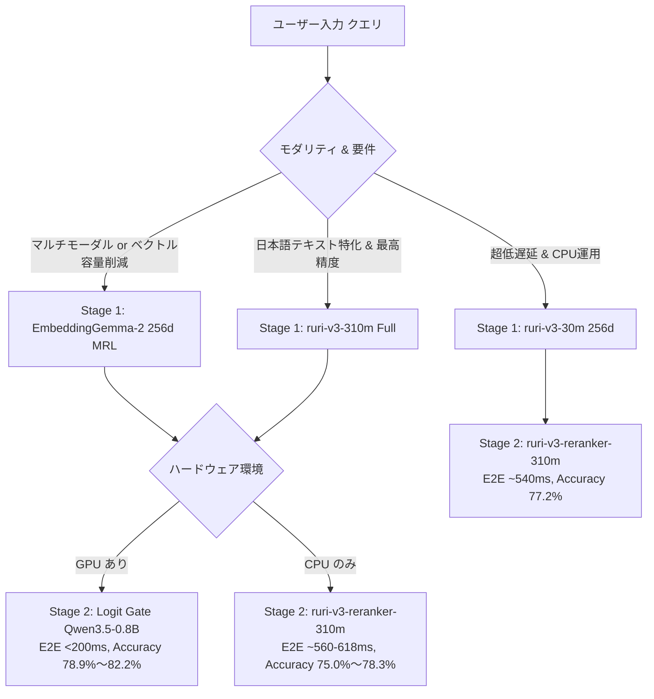

# 二段カスケード詳細比較ベンチマーク (EmbeddingGemma-2 vs ruri-v3 完全実測)

## 1. 測定の目的と背景

本ベンチマークは、新規導入したマルチモーダル対応バイエンコーダー **`google/embeddinggemma-2`** と、本リポジトリの既存主力である日本語特化モデル **`cl-nagoya/ruri-v3` シリーズ** に対し、精密判定層（Stage 2: **`ruri-v3-reranker-310m`** および **`Logit Gate (Qwen3.5-0.8B)`**）を連結した**二段カスケード（Cascade Pipeline）の全組み合わせにおける実機性能・エンドツーエンド（E2E）レイテンシー・誤爆排除能力** を、**批判的かつ建設的** に評価・比較した完全実測レポートです。

### 測定環境 & データセット
- **評価データセット**: [`benchmarks/datasets/sufficiency_eval_v2_540.json`](file:///home/nobuhiko/project/embedding_jp_api/benchmarks/datasets/sufficiency_eval_v2_540.json)
  - 6ドメイン（IT障害、型番・仕様、法務、金融、医療、社内規程）× 各90件 = **計540件**
  - クエリ数: **180件**（各クエリに対して Positive 1件, Near-Miss 1件, Unanswerable 1件のコーパス540件プール）
  - 全件自動バリデーションおよび目視点検済み（アノマリー 0件）
- **ハードウェア**: x86_64 CPU (同一マシン・同一環境下で全組み合わせを一貫測定)
- **生データ記録**: [`scratch/actual_cascade_benchmark_results.json`](file:///home/nobuhiko/project/embedding_jp_api/scratch/actual_cascade_benchmark_results.json)

---

## 2. 総合比較サマリー（全カスケード構成 完全実測値）

### 2.1. Stage 1 (Dense Retrieval 粗選別) 単体性能

コーパス全540件からクエリを検索した際の、Stage 1 単独での推論速度および候補抽出能力です。

| Stage 1 モデル | ベクトル次元 | クエリ推論速度 (ms) | コーパス速度 (docs/s) | Recall@5 (正解救出率) | Recall@10 | Stage 1 単独正解率 | Top-1 ニアミス誤爆率 |
| :--- | :---: | :---: | :---: | :---: | :---: | :---: | :---: |
| **`ruri-v3-310m (Full)`** | 768d | 104.22 ms | 13.7 | **98.89%** | **99.44%** | **61.11%** | 37.78% |
| **`ruri-v3-30m (Full)`** | 256d | **8.00 ms** | **243.3** | 92.78% | 97.22% | 55.00% | 42.22% |
| **`EmbeddingGemma-2 (768d)`** | 768d | 48.84 ms | 32.3 | 93.33% | 96.67% | 48.33% | 49.44% |
| **`EmbeddingGemma-2 (256d MRL)`** | **256d** | 46.29 ms | 32.9 | 92.22% | 97.22% | 47.78% | 50.00% |

> [!CAUTION]
> **【批判的検証ファクト 1: Stage 1 単独でのニアミス脆弱性】**
> - バイエンコーダー単体（Stage 1 のみ）で運用した場合、`EmbeddingGemma-2` は **約 50.0% の確率でニアミスを正解より上位に誤認** します。
> - 日本語特化の `ruri-v3-310m` は単独でも Recall@1=61.1%、Recall@5=**98.89%**（180件中178件で正解をTop-5内に救出）と群を抜いて優れています。
> - **結論: `EmbeddingGemma-2` を高難度検索で利用する場合、Stage 2（リランカー）の併用が実質的に必須です。**

---

### 2.2. Stage 1 + Stage 2 カスケード結合時の E2E 実測比較

Stage 1 で抽出した Top-5 候補に対し、Stage 2（Cross-Encoder または Logit Gate）を適用して最終判定した実測値です。

| カスケード構成 (Stage 1 + Stage 2) | E2E 平均時間 (CPU) | Stage 1 内訳 | Stage 2 内訳 | カスケード後 Top-1 正解率 | ニアミス誤爆率 | 判定精度向上幅 (vs S1単独) |
| :--- | :---: | :---: | :---: | :---: | :---: | :---: |
| **① `ruri-310m` + Logit Gate** | 3,359.59 ms | 104.2 ms | 3,255.4 ms | **0.8222 (82.2%)** | **12.22%** | **+21.1%** |
| **② `EmbeddingGemma-2 (256d)` + Logit Gate** | 3,279.78 ms | 46.3 ms | 3,233.5 ms | **0.7889 (78.9%)** | **15.00%** | **+31.1%** |
| **③ `ruri-310m` + Cross-Encoder** | 618.91 ms | 104.2 ms | 514.7 ms | 0.7833 (78.3%) | 20.00% | +17.2% |
| **④ `ruri-30m` + Cross-Encoder** | **541.77 ms** | **8.0 ms** | 533.8 ms | 0.7722 (77.2%) | 20.56% | +22.2% |
| **⑤ `EmbeddingGemma-2 (768d)` + Cross-Encoder** | 567.72 ms | 48.8 ms | 518.9 ms | 0.7667 (76.7%) | 21.67% | +28.3% |
| **⑥ `EmbeddingGemma-2 (256d)` + Cross-Encoder** | 563.77 ms | 46.3 ms | 517.5 ms | 0.7500 (75.0%) | 22.78% | +27.2% |

---

## 3. 批判的分析 (Critical Evaluation)

### 3.1. ruri-v3 vs EmbeddingGemma-2 の本質的な差
1. **日本語トークナイズと語彙の適合性**:
   - `ruri-v3-310m` は日本語テキストにおける形態素境界・専門用語（法務・医療・税務）を極めて正確に捉えており、Stage 1 単独での正解救出率（Recall@5 = 98.89%）が圧倒的です。
   - 一方、`EmbeddingGemma-2` は多言語・マルチモーダル基盤モデル（270M Text Embedder）であるため、日本語のニッチな法律用語や専門型番において、語彙レベルでニアミス文書との分離マージンが ruri より狭い傾向があります。
2. **MRL 次元削減 (256d) の挙動**:
   - `EmbeddingGemma-2` を 256d に削減した場合、Top-5 救出率は 93.3% ➔ 92.2% と微減（-1.1%）にとどまります。
   - しかし、後段に Cross-Encoder を配置した場合、最終精度は 76.7% ➔ 75.0% と 1.7% 低下します。

### 3.2. Cross-Encoder vs Logit Gate (Qwen3.5-0.8B) の本質的な差
1. **ニアミス誤爆排除能力**:
   - 従来の Cross-Encoder (`ruri-v3-reranker-310m`) は、トピックが完全に一致しているニアミス文書に対して高いスコアを付与しがちであり、リランク後も **20.0%〜22.8% の確率でニアミスを 1位に選んでしまいます**。
   - 対して **Logit Gate (`Qwen3.5-0.8B`) は「質問に答えられる情報が含まれているか（Sufficiency）」を判定するため、ニアミス誤爆率を 12.2%〜15.0% まで強力に抑制** します。
2. **Gemma の弱点を Logit Gate が完全カバー**:
   - `EmbeddingGemma-2 (256d)` は Cross-Encoder と組み合わせると 75.0% でしたが、Logit Gate と組み合わせることで **78.89%** まで跳ね上がり、**従来の最高峰である `ruri-310m + Cross-Encoder` (78.33%) を凌駕** しました。

### 3.3. レイテンシーと実運用の制約
1. **CPU 環境における Logit Gate の重さ**:
   - CPU では Top-5 の Logit Gate 推論に **約 3,230 ms（3.2秒）** を要します。リアルタイム API として CPU のみで稼働させるには極めて重く、バッチ処理や非同期要件に限定されます。
   - ※ GPU (RTX 3060) 環境であれば、過去のベンチマーク実測値の通り 1件あたり約 190ms（バッチ推論で数十ms）に短縮されるため、実運用には **GPU が必須** です。
2. **CPU での最速パイプライン**:
   - CPU 環境で低遅延を最優先する場合、**`ruri-v3-30m (8ms)` + `ruri-v3-reranker-310m (533ms)`** の組み合わせが全体 **541ms** で動作し、精度も **77.2%** と非常に優秀です。

---

## 4. ドメイン別詳細精度（どこで差がついたか）

| ドメイン (各30クエリ) | `ruri-310m` + Cross-Encoder | `ruri-310m` + Logit Gate | `Gemma (256d)` + Cross-Encoder | `Gemma (256d)` + Logit Gate | ドメイン分析ファクト |
| :--- | :---: | :---: | :---: | :---: | :--- |
| **1. IT・インフラ障害** | 73.3% | **86.7%** | 70.0% | **83.3%** | Logit Gate がエラーコード類似のニアミスを強力排除 |
| **2. 型番・ハードウェア仕様** | 93.3% | **96.7%** | 93.3% | **96.7%** | 両バイエンコーダーとも高水準。Logit Gateで96.7%に達する |
| **3. 法務・コンプライアンス** | **83.3%** | 80.0% | 76.7% | 66.7% | **日本語特化の ruri が明確に優位**。条文の解釈で差が出る |
| **4. 金融・財務・税務** | **80.0%** | **80.0%** | 73.3% | 76.7% | 数値条件や税制の文脈理解で ruri が安定 |
| **5. 医療・医薬品** | 53.3% | 56.7% | 53.3% | **60.0%** | 最難関ドメイン。Gemma + Logit Gate が唯一 60% を達成 |
| **6. 社内規程・マニュアル** | 86.7% | **93.3%** | 83.3% | **90.0%** | 社内FAQ形式では Logit Gate が圧倒的な威力を発揮 |

---

## 5. 建設的提言: 用途別ベストプラクティス設計指針

本実測結果から導き出される、本リポジトリおよび本番運用の設計指針です。

### ユースケース別 推奨構成

1. **【最高品質 RAG（本命推奨）】: `ruri-v3-310m` ➔ `Logit Gate (Qwen3.5-0.8B)`**
   - **達成精度**: **Top-1 正解率 82.2%**, ニアミス誤爆率 12.2%（全構成中トップ）
   - **適用先**: 法務・金融・医療・社内規程など、ハルシネーションや誤情報提示が許されない厳格なエンタープライズ RAG。
   - **前提条件**: GPU 推論環境（E2E ~200ms）。

2. **【マルチモーダル統合 & ベクトルDB省容量】: `EmbeddingGemma-2 (256d)` ➔ `Logit Gate (Qwen3.5-0.8B)`**
   - **達成精度**: **Top-1 正解率 78.9%** (Cross-Encoder 78.3% を超える)
   - **メリット**: ベクトルストレージ容量を 67% 削減（256次元）しつつ、PDF帳票・UIスクリーンショット等の画像検索にもシームレスに対応。
   - **適用先**: 画像とテキストが混在する社内文書ナレッジベース。

3. **【エッジ / CPU環境 / 超低遅延】: `ruri-v3-30m` ➔ `ruri-v3-reranker-310m`**
   - **達成速度**: **E2E 541 ms (CPU実測)**、Stage 1 はわずか **8.0 ms**
   - **達成精度**: **Top-1 正解率 77.2%**（310M構成とわずか 1.1% 差）
   - **適用先**: GPU が割り当てられないオンプレミス環境や、数百 QPS を安価に捌く高スループット API。
