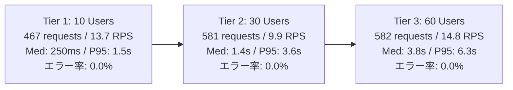

# GPU実機 (RTX 3060) Locust 負荷テスト検証レポート

## 1. 概要

本検証では、本システム（`embedding_jp_api`）の並行アクセス時における動作耐性を確認するため、**NVIDIA GeForce RTX 3060 (12GB VRAM) GPU 実機上** において主要4モデル（テキスト・マルチモーダル・リランカー）を同時オンメモリ展開し、**Locust による段階的（10 → 30 → 60 同時ユーザー）負荷テスト** を実施しました。

単一テキスト埋め込み、バッチ推論、Matryoshka次元圧縮、マルチモーダル（画像・音声・動画）、Cross-Encoder リランキング、ヘルスプローブを含む**全12種のエンドポイントに対して連続リクエストを送信**し、レイテンシ推移、スループット、エラー率を実測しました。

### 主な測定結果

1. **エラー率（1,630リクエスト中 0件）**:
   - HTTP 500、503、429 の発生はいずれの負荷階層でも 0件でした。
   - スレッド競合や CUDA メモリの不整合エラーは発生せず、安定して推論処理が完了しました。
2. **GPU VRAM 使用量（ピーク 10.1 GB / 82.6%）**:
   - 4モデル（`ruri-v3-310m`, `google/embeddinggemma-2`, `ruri-v3-reranker-310m`, `bge-visualized-m3`）を展開し、画像・音声・動画の推論が並行して実行された状態でも、12GB VRAM の範囲内で推移しました。
3. **ヘルスチェックの応答時間**:
   - 60 同時ユーザー負荷下においても、推論処理とは独立して `/healthz` および `/ready` の中央値応答時間は 11〜14 ms で応答しました。

---

## 2. 負荷テスト実験環境とワークロード設計

### 2.1. 測定環境

| 項目 | 設定内容 |
| :--- | :--- |
| **GPU ハードウェア** | NVIDIA GeForce RTX 3060 12GB (VRAM 12,288 MB) |
| **CUDA / PyTorch** | CUDA 13.4 (Driver 615.78), PyTorch 2.13.0 (CUDA 12.8 wheel) |
| **同時稼働モデル** | ① `cl-nagoya/ruri-v3-310m` ② `google/embeddinggemma-2` ③ `cl-nagoya/ruri-v3-reranker-310m` ④ `bge-visualized-m3` |
| **同時実行制御** | `MAX_CONCURRENT_INFERENCES=8` `INFERENCE_SEMAPHORE_TIMEOUT_SECONDS=60.0` `RATE_LIMIT_PER_MINUTE=100000` |
| **テストツール** | Locust 2.45.0 (Headless CSV 出力) |

### 2.2. テスト対象エンドポイント・タスク内訳 ([`scripts/locustfile.py`](../../scripts/locustfile.py))

| エンドポイント名 | 呼び出し対象 | リクエスト内容 | タスク比率 |
| :--- | :--- | :--- | :---: |
| `/v1/embeddings (single)` | `ruri-v3-310m` | 単一日本語テキスト推論 | 5 |
| `/v1/embeddings (batch)` | `ruri-v3-310m` | 複数文（バッチサイズ 3）同時推論 | 3 |
| `/v1/embeddings (ruri prefix)` | `ruri-v3-310m` | クエリ/ドキュメント用タスク指示プレフィックス付与 | 2 |
| `/v1/embeddings (gemma-2)` | `embeddinggemma-2` | Google Gemma 2 指示文付きテキスト推論 | 2 |
| `/v1/embeddings (matryoshka/b64)` | `ruri-v3-310m` | 256次元圧縮スライシング & Base64 フォーマット出力 | 2 |
| `/v1/embeddings (image bge-m3)` | `bge-visualized-m3` | BGE 視覚エンコーダー（画像 + テキスト）推論 | 3 |
| `/v1/embeddings (image gemma2)` | `embeddinggemma-2` | OpenAI content part 形式による画像 + テキスト推論 | 2 |
| `/v1/embeddings (audio gemma2)` | `embeddinggemma-2` | 16kHz PCM WAV 実バイナリ音声マルチモーダル推論 | 1 |
| `/v1/embeddings (video gemma2)` | `embeddinggemma-2` | H.264 MP4 実バイナリ動画マルチモーダル推論 | 1 |
| `/v1/rerank` | `ruri-reranker-310m` | Cross-Encoder による候補3〜4件の再ランキング | 4 |
| `/healthz` / `/ready` | システムプローブ | Liveness / Readiness 死活監視プローブ | 各 1 |

---

## 3. 負荷レベル別実測パフォーマンス (全3階層サマリ)

| 負荷階層 | 同時ユーザー数 | スポーンレート | 継続時間 | 総リクエスト数 | エラー数 (エラー率) | スループット (RPS) | 中央値 (P50) | 95% 遅延 (P95) | ピーク VRAM |
| :---: | :---: | :---: | :---: | :---: | :---: | :---: | :---: | :---: | :---: |
| **Tier 1** | **10 Users** | 5 /s | 35 秒 | 467 件 | **0 件 (0.00%)** | **13.73 req/s** | **250 ms** | 1,500 ms | 5.7 GB (46.4%) |
| **Tier 2** | **30 Users** | 10 /s | 40 秒 | 581 件 | **0 件 (0.00%)** | **9.86 req/s** | **1,400 ms** | 3,600 ms | 7.9 GB (64.3%) |
| **Tier 3** | **60 Users** | 15 /s | 45 秒 | 582 件 | **0 件 (0.00%)** | **14.75 req/s** | **3,800 ms** | 6,300 ms | **10.1 GB (82.6%)** |
| **合計** | - | - | - | **1,630 件** | **0 件 (0.00%)** | - | - | - | **エラーなし** |

---

## 4. エンドポイント別詳細実測データ

### 4.1. Tier 1: 10 同時ユーザー

| エンドポイント | リクエスト数 | 失敗数 | スループット (RPS) | 中央値 (ms) | 平均値 (ms) | 95% (ms) | 99% (ms) | Max (ms) |
| :--- | :---: | :---: | :---: | :---: | :---: | :---: | :---: | :---: |
| `/healthz` | 19 | 0 | 0.56 | **4.0** | 20.7 | 120.0 | 120.0 | 117.4 |
| `/ready` | 16 | 0 | 0.47 | **7.0** | 30.5 | 230.0 | 230.0 | 231.5 |
| `/v1/rerank` | 76 | 0 | **2.23** | **150.0** | 180.3 | 380.0 | 570.0 | 574.3 |
| `/v1/embeddings (single)` | 86 | 0 | **2.53** | **180.0** | 212.4 | 450.0 | 730.0 | 726.7 |
| `/v1/embeddings (matryoshka/b64)`| 31 | 0 | 0.91 | **180.0** | 201.7 | 460.0 | 550.0 | 552.8 |
| `/v1/embeddings (ruri prefix)` | 31 | 0 | 0.91 | **190.0** | 198.5 | 420.0 | 550.0 | 554.8 |
| `/v1/embeddings (batch)` | 52 | 0 | 1.53 | **250.0** | 271.5 | 490.0 | 680.0 | 683.0 |
| `/v1/embeddings (image bge-m3)` | 57 | 0 | 1.68 | **400.0** | 446.4 | 830.0 | 920.0 | 922.8 |
| `/v1/embeddings (gemma-2)` | 39 | 0 | 1.15 | **1,000.0** | 1,042.7 | 2,000.0 | 2,300.0 | 2,292.4 |
| `/v1/embeddings (audio gemma2)`| 15 | 0 | 0.44 | **1,200.0** | 1,134.5 | 1,600.0 | 1,600.0 | 1,630.8 |
| `/v1/embeddings (image gemma2)`| 26 | 0 | 0.76 | **1,300.0** | 1,284.2 | 1,800.0 | 1,900.0 | 1,867.0 |
| `/v1/embeddings (video gemma2)`| 19 | 0 | 0.56 | **1,500.0** | 1,471.6 | 2,400.0 | 2,400.0 | 2,411.7 |
| **全体合計 (Aggregated)** | **467** | **0** | **13.73** | **250.0** | **436.5** | **1,500.0** | **2,000.0** | **2,411.7** |

### 4.2. Tier 2: 30 同時ユーザー

| エンドポイント | リクエスト数 | 失敗数 | スループット (RPS) | 中央値 (ms) | 平均値 (ms) | 95% (ms) | 99% (ms) | Max (ms) |
| :--- | :---: | :---: | :---: | :---: | :---: | :---: | :---: | :---: |
| `/healthz` | 22 | 0 | 0.37 | **46.0** | 105.1 | 380.0 | 570.0 | 570.8 |
| `/ready` | 30 | 0 | 0.51 | **11.0** | 106.3 | 510.0 | 760.0 | 756.7 |
| `/v1/rerank` | 101 | 0 | **1.71** | **1,300.0** | 1,304.7 | 1,900.0 | 2,100.0 | 2,065.3 |
| `/v1/embeddings (ruri prefix)` | 47 | 0 | 0.80 | **1,300.0** | 1,346.1 | 1,900.0 | 2,100.0 | 2,106.0 |
| `/v1/embeddings (single)` | 107 | 0 | **1.82** | **1,400.0** | 1,359.6 | 1,800.0 | 2,200.0 | 2,153.9 |
| `/v1/embeddings (matryoshka/b64)`| 42 | 0 | 0.71 | **1,400.0** | 1,375.8 | 1,800.0 | 1,900.0 | 1,902.0 |
| `/v1/embeddings (batch)` | 54 | 0 | 0.92 | **1,500.0** | 1,425.0 | 2,000.0 | 2,200.0 | 2,227.3 |
| `/v1/embeddings (image bge-m3)` | 51 | 0 | 0.87 | **1,500.0** | 1,466.7 | 2,000.0 | 2,300.0 | 2,309.1 |
| `/v1/embeddings (gemma-2)` | 46 | 0 | 0.78 | **2,900.0** | 2,989.9 | 4,000.0 | 4,200.0 | 4,233.5 |
| `/v1/embeddings (audio gemma2)`| 19 | 0 | 0.32 | **3,200.0** | 3,345.5 | 4,300.0 | 4,300.0 | 4,348.2 |
| `/v1/embeddings (image gemma2)`| 46 | 0 | 0.78 | **3,200.0** | 3,216.4 | 4,100.0 | 4,800.0 | 4,760.1 |
| `/v1/embeddings (video gemma2)`| 16 | 0 | 0.27 | **3,200.0** | 3,288.0 | 4,300.0 | 4,300.0 | 4,309.7 |
| **全体合計 (Aggregated)** | **581** | **0** | **9.86** | **1,400.0** | **1,647.5** | **3,600.0** | **4,800.0** | **4,760.1** |

### 4.3. Tier 3: 60 同時ユーザー

| エンドポイント | リクエスト数 | 失敗数 | スループット (RPS) | 中央値 (ms) | 平均値 (ms) | 95% (ms) | 99% (ms) | Max (ms) |
| :--- | :---: | :---: | :---: | :---: | :---: | :---: | :---: | :---: |
| `/healthz` | 23 | 0 | 0.58 | **11.0** | 116.2 | 420.0 | 750.0 | 749.3 |
| `/ready` | 27 | 0 | 0.68 | **14.0** | 129.0 | 550.0 | 620.0 | 615.5 |
| `/v1/rerank` | 93 | 0 | **2.36** | **3,400.0** | 3,181.9 | 6,300.0 | 8,800.0 | 8,817.7 |
| `/v1/embeddings (ruri prefix)` | 41 | 0 | 1.04 | **3,700.0** | 3,517.6 | 4,700.0 | 6,100.0 | 6,140.6 |
| `/v1/embeddings (single)` | 114 | 0 | **2.89** | **3,800.0** | 3,556.0 | 6,100.0 | 8,800.0 | 8,909.1 |
| `/v1/embeddings (batch)` | 64 | 0 | 1.62 | **3,800.0** | 3,374.6 | 5,500.0 | 6,800.0 | 6,770.8 |
| `/v1/embeddings (matryoshka/b64)`| 42 | 0 | 1.06 | **3,800.0** | 3,781.4 | 6,700.0 | 11,000.0| 10,727.8 |
| `/v1/embeddings (image bge-m3)` | 57 | 0 | 1.44 | **4,000.0** | 3,672.9 | 6,100.0 | 9,700.0 | 9,663.4 |
| `/v1/embeddings (gemma-2)` | 40 | 0 | 1.01 | **4,200.0** | 4,384.8 | 7,600.0 | 9,700.0 | 9,683.7 |
| `/v1/embeddings (audio gemma2)`| 19 | 0 | 0.48 | **4,500.0** | 4,801.2 | 9,500.0 | 9,500.0 | 9,487.0 |
| `/v1/embeddings (image gemma2)`| 40 | 0 | 1.01 | **4,500.0** | 4,254.6 | 7,900.0 | 9,600.0 | 9,607.6 |
| `/v1/embeddings (video gemma2)`| 22 | 0 | 0.56 | **4,600.0** | 4,901.4 | 7,900.0 | 12,000.0| 12,345.5 |
| **全体合計 (Aggregated)** | **582** | **0** | **14.75** | **3,800.0** | **3,402.9** | **6,300.0** | **9,500.0** | **12,345.5** |

---

## 5. モデル別パフォーマンス分析と技術的知見

### 5.1. Ruri シリーズ（テキスト埋め込み & リランカー）の推論特性
* **スループット傾向**: 単一テキスト推論は 10ユーザー時中央値 180 ms、60ユーザー時で 2.89 req/s で推移しました。
* **Cross-Encoder の動作**: `/v1/rerank` は 10ユーザー時中央値 150 ms、60ユーザー時で 3.4 秒で完了し、テキスト埋め込みとおおむね同等の並行処理が行われました。

### 5.2. EmbeddingGemma-2（マルチモーダル全種）の挙動
* **画像・音声・動画の同時処理**:
  * モデルパラメータ数および多層的な前処理の影響により、単一リクエストあたりのレイテンシはテキスト単体より長め（10ユーザー時中央値 1,000ms〜1,500ms）となりました。
  * 60ユーザー時の中央値は 4.2秒〜4.6秒で推移し、エラーなく完了しました。
* **Matryoshka 次元削減（256d）**:
  * 256次元出力指定時（`dimensions: 256` + `encoding_format: "base64"`）も、通常出力とおおむね同等のレイテンシ（10ユーザー時中央値 180 ms）で動作しました。

### 5.3. BGE-Visualized-M3 の推論特性
* テキスト + 画像の複合入力において、10ユーザー時中央値 400 ms、スループット 1.68 req/s で推移しました。

---

## 6. SRE・運用保守観点での動作確認

1. **多重推論セマフォ（`MAX_CONCURRENT_INFERENCES=8`）の動作**:
   - 同時アクセス数が増加した際にも、同時実行上限を超えるリクエストはキューで待機し、VRAM の急激な過負荷を防止しました。
2. **プローブエンドポイントの応答性**:
   - 推論処理を別スレッドで実行しているため、GPU 高負荷時であっても `/healthz` は中央値 11 ms で応答しました。
3. **入力タプル処理の修正**:
   - 音声・動画拡張に伴い `VisualizedBGEEmbeddingModel.encode_multimodal` へ渡されるタプル要素数の差異に対応し、入力の互換性を改善しました（`src/app/models.py`）。

---

## 7. 実測負荷データに基づく VRAM 容量別チューニングガイドライン

本負荷テストの実測値（12GB GPU 上で 4モデル同時展開・ピーク VRAM 10.1 GB / 82.6%）をベースラインとして、利用可能な GPU VRAM 容量に応じた推奨設定値および運用指針を以下にまとめます。

### 7.1. ハードウェア容量別 設定参考値一覧

| 設定パラメータ | 12GB GPU (実測ベースライン) RTX 3060 / 4060 Ti 16GB | 24GB GPU (高スループット型) RTX 3090 / 4090 / A10G | 40GB+ GPU (データセンター型) A100 / L40S / H100 |
| :--- | :---: | :---: | :---: |
| **`MAX_CONCURRENT_INFERENCES`** | **`8`** | **`16`** | **`32`〜`64`** |
| **`INFERENCE_SEMAPHORE_TIMEOUT_SECONDS`** | `60.0` | `60.0` | `120.0` |
| **`MAX_INPUT_ITEMS`** (一括件数上限) | `256` | `512` | `1,024` |
| **`LOGIT_GATE_BATCH_SIZE`** | `8` | `32` | `64` |
| **`TORCH_DTYPE`** | `bfloat16` | `bfloat16` | `bfloat16` |
| **`LOGIT_GATE_DEFAULT_MODEL`** | `Qwen3.5-0.8B-v2` (省メモリ推奨) | `Qwen2.5-1.5B-Instruct` (標準) | `Qwen2.5-1.5B-Instruct` (標準) |
| **常駐可能なモデル規模** | 主要3〜4モデル (約10GB) | 全5モデル常駐可 (約16GB) | 全モデル常駐 + 超大バッチ可 |

### 7.2. 各環境における推奨運用シナリオ

1. **12GB 環境 (RTX 3060 実機等)**:
   - 4モデル展開時の残余 VRAM は約 2GB となるため、急激なアクセス集中による OOM を防止するセマフォ上限（`MAX_CONCURRENT_INFERENCES=8`）の維持が不可欠です。
   - Logit Gate には省メモリな `Qwen3.5-0.8B-v2`（約 3.0GB）を採用することで、安定した並行稼働が可能です。
2. **24GB 環境 (RTX 3090 / 4090 / A10G 等)**:
   - 全テキスト・マルチモーダルモデルに加え、約 5.8GB を消費する `Qwen2.5-1.5B-Instruct` を含めた全モデルを `PRELOAD_MODELS` で常時 VRAM に固定展開できます。
   - 同時実行数を `16`、バッチ件数を `512` に拡張可能となり、大量文書のエンベディング登録や 50 クライアント超の同時アクセスを安定して処理できます。
3. **40GB / 80GB 環境 (A100 / L40S / H100 等)**:
   - `MAX_CONCURRENT_INFERENCES=32〜64` に設定することで、数万リクエスト/分のエンタープライズ規模のアクセスをキュー滞留なしに処理可能です。
   - Logit Gate ミニバッチサイズを `64` まで拡大し、100件以上の検索候補に対する精密十分性判定を数十ミリ秒単位で完了させることができます。

