# マルチモーダル評価データセット 目視点検シート

以下のリストは生成されたデータセットの目視点検用です。
各項目について、「画像・クエリ・正解/ニアミス説明」の整合性を確認してください。

## 点検チェックリスト
- [ ] 解像度や画像の視認性に問題はないか
- [ ] テキスト（クエリ等）が画像と適切に対応しているか
- [ ] 正解説明（Positive）とニアミス説明（Hard Negative）の意味の対比が明確で、難易度が適切か

### ID: business_charts_01 (business_charts)
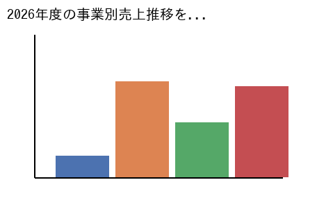

- **Query**: 2026年度の事業別売上推移を示す棒グラフを検索してください。
- **Positive Description**: 2026年度のクラウド事業とAIソリューション事業の売上高推移を比較した棒グラフ。第3四半期に急成長していることが確認できる。
- **Hard Negative Description**: 2025年度の営業利益と経常利益の推移を示した折れ線グラフ。売上高ではなく利益の推移を表しているため不適切である。

---

### ID: business_charts_02 (business_charts)
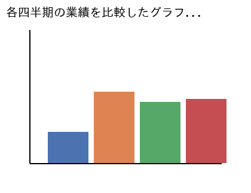

- **Query**: 各四半期の業績を比較したグラフを含む資料を提示してください。
- **Positive Description**: 第1四半期から第4四半期までの業績を比較した詳細なグラフ資料。季節要因による変動が明確に視覚化されている。
- **Hard Negative Description**: 年間の総業績のみを記載したサマリーレポート。四半期ごとの詳細な比較が含まれていないため要件を満たさない。

---

### ID: business_charts_03 (business_charts)
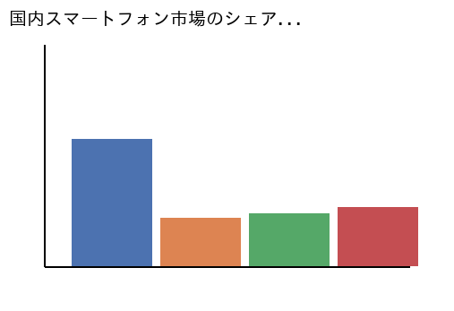

- **Query**: 国内スマートフォン市場のシェアを示す円グラフを探して。
- **Positive Description**: 2025年における国内スマートフォン市場のベンダー別シェアをパーセンテージで示した円グラフ。A社がトップである。
- **Hard Negative Description**: グローバル市場におけるPC出荷台数のシェアを示した円グラフ。国内のスマートフォン市場ではないため該当しない。

---

### ID: business_charts_04 (business_charts)
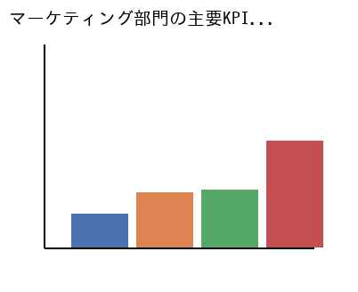

- **Query**: マーケティング部門の主要KPIをまとめたダッシュボード画面。
- **Positive Description**: マーケティング部門におけるCPAやCVRなどの主要KPIをリアルタイムで一覧表示しているダッシュボード画面。
- **Hard Negative Description**: 人事部門の採用目標達成率をまとめたダッシュボード画面。マーケティング部門のKPIではないため不適当である。

---

### ID: business_charts_05 (business_charts)
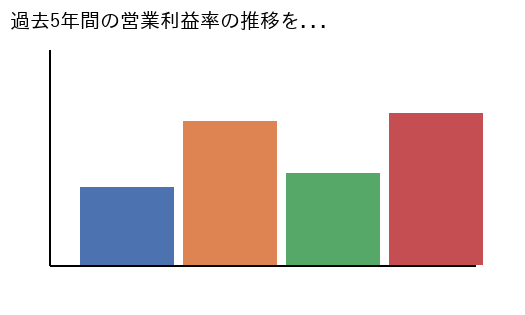

- **Query**: 過去5年間の営業利益率の推移を示すチャートを見せてください。
- **Positive Description**: 2021年から2025年までの5年間における当社の営業利益率の推移を詳細に示した折れ線グラフチャート。
- **Hard Negative Description**: 過去5年間の売上高推移を示した棒グラフ。利益率ではなく売上高を示しているため検索要件に合致しない。

---

### ID: business_charts_06 (business_charts)
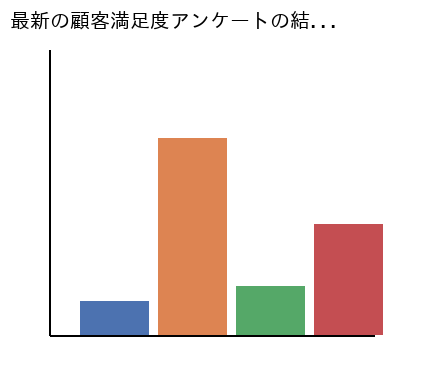

- **Query**: 最新の顧客満足度アンケートの結果をまとめたグラフ資料。
- **Positive Description**: 2026年1月に実施された最新の顧客満足度アンケートの回答結果をカテゴリ別に集計した見やすいグラフ資料。
- **Hard Negative Description**: 3年前に実施された旧製品に関するアンケート結果資料。最新のデータではないため今回の要件には合致しない。

---

### ID: business_charts_07 (business_charts)
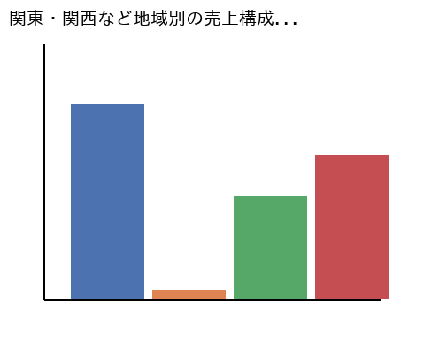

- **Query**: 関東・関西など地域別の売上構成比がわかるグラフを検索。
- **Positive Description**: 関東、関西、中部などの主要地域別の売上構成比を視覚的にわかりやすく表現した円グラフまたは帯グラフ。
- **Hard Negative Description**: 製品カテゴリ別の売上構成比を示したグラフ。地域別のデータが含まれていないため検索意図から外れている。

---

### ID: business_charts_08 (business_charts)
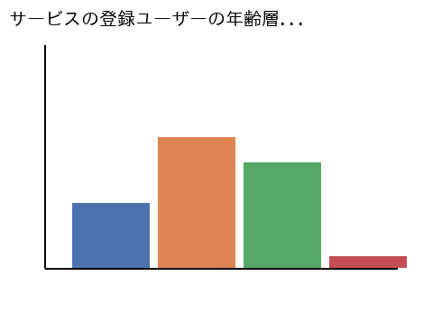

- **Query**: サービスの登録ユーザーの年齢層別分布状況を示すデータ。
- **Positive Description**: 当社の主力サービスにおける10代から60代までの登録ユーザーの年齢層別分布を詳細に示したヒストグラム。
- **Hard Negative Description**: 従業員の年齢構成比を示したグラフ。サービスのユーザー分布ではないため今回の検索要件には合致しない。

---

### ID: business_charts_09 (business_charts)
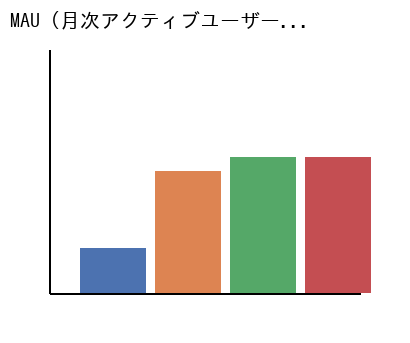

- **Query**: MAU（月次アクティブユーザー）の直近1年間の推移グラフ。
- **Positive Description**: 直近1年間におけるMAU（月次アクティブユーザー数）の増減トレンドを月ごとにプロットした折れ線グラフ。
- **Hard Negative Description**: DAU（日次アクティブユーザー）の直近1週間の推移グラフ。期間と指標が異なるため検索要件を満たしていない。

---

### ID: business_charts_10 (business_charts)
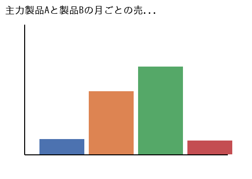

- **Query**: 主力製品Aと製品Bの月ごとの売上比較グラフを探して。
- **Positive Description**: 主力製品Aと製品Bについて、過去12ヶ月間の月次売上高を並べて比較したグループ化棒グラフによる資料。
- **Hard Negative Description**: 全製品の合計売上高の推移を示したグラフ。製品ごとの詳細な比較が含まれていないため今回の要件には合致しない。

---

### ID: business_charts_11 (business_charts)
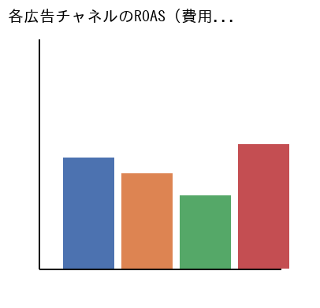

- **Query**: 各広告チャネルのROAS（費用対効果）を分析したチャート。
- **Positive Description**: SNS広告や検索連動型広告など、各広告チャネル別のROAS（費用対効果）を比較分析したバブルチャート。
- **Hard Negative Description**: 広告費用の総額推移のみを示したグラフ。費用対効果（ROAS）の分析が含まれていないため検索要件を満たさない。

---

### ID: business_charts_12 (business_charts)
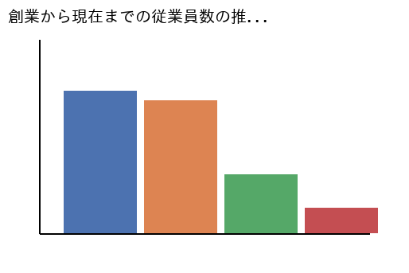

- **Query**: 創業から現在までの従業員数の推移を示すグラフ資料。
- **Positive Description**: 会社設立時から現在に至るまでの、正社員および契約社員の合計従業員数の年次推移を示した面グラフ資料。
- **Hard Negative Description**: 部門別の現在の従業員数を示した円グラフ。時系列での推移が表現されていないため検索意図から外れている。

---

### ID: business_charts_13 (business_charts)
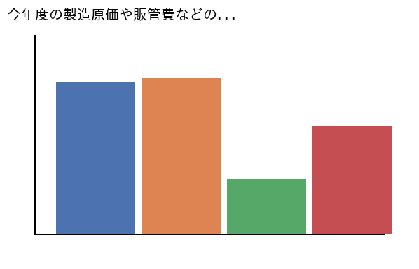

- **Query**: 今年度の製造原価や販管費などのコスト構造を分析した図。
- **Positive Description**: 今年度における製造原価、販売費、および一般管理費の割合と内訳を詳細に分析したウォーターフォール図。
- **Hard Negative Description**: 次年度の売上目標をまとめた資料。コスト構造の分析結果が含まれていないため今回の検索要件には合致しない。

---

### ID: business_charts_14 (business_charts)
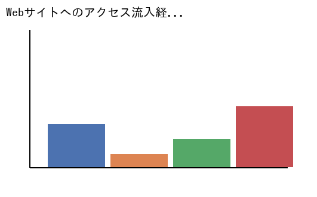

- **Query**: Webサイトへのアクセス流入経路の比率を示すグラフ。
- **Positive Description**: オーガニック検索、SNS、リファラルなど、当社のWebサイトへの主なアクセス流入経路の比率を示すドーナツグラフ。
- **Hard Negative Description**: Webサイトの月間ページビュー数の推移を示すグラフ。流入経路の比率情報が含まれていないため不適当である。

---

### ID: business_charts_15 (business_charts)
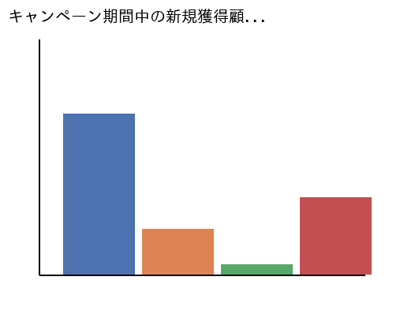

- **Query**: キャンペーン期間中の新規獲得顧客数の推移グラフ。
- **Positive Description**: 夏季の特別キャンペーン期間中における日別の新規獲得顧客数の推移を詳細にトラッキングした折れ線グラフ。
- **Hard Negative Description**: 既存顧客の解約率の推移を示したグラフ。新規獲得顧客に関するデータではないため今回の要件には合致しない。

---

### ID: document_layouts_01 (document_layouts)
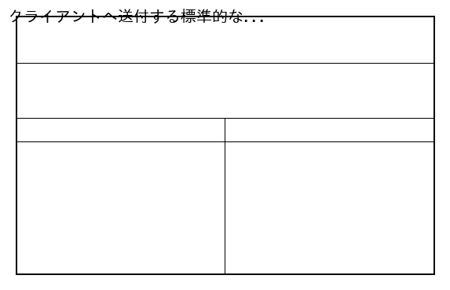

- **Query**: クライアントへ送付する標準的な請求書と明細表のフォーマット。
- **Positive Description**: システム開発案件の納品後にクライアントへ送付するための、標準的な御請求書および詳細な明細表のフォーマット。
- **Hard Negative Description**: 社内でのみ使用される仮払いの申請書フォーマット。クライアント向けの請求書ではないため検索意図と異なる。

---

### ID: document_layouts_02 (document_layouts)
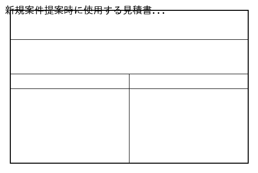

- **Query**: 新規案件提案時に使用する見積書の公式テンプレート。
- **Positive Description**: 新規プロジェクトの提案時にお客様に提出するための、金額や内訳が記載された公式な見積書テンプレート。
- **Hard Negative Description**: すでに終了したプロジェクトの完了報告書。見積金額や提案内容が記載されていないため今回の要件には合致しない。

---

### ID: document_layouts_03 (document_layouts)
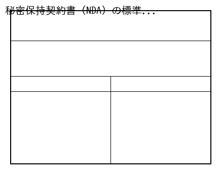

- **Query**: 秘密保持契約書（NDA）の標準的なヘッダー部分のレイアウト。
- **Positive Description**: 新規取引先と締結する秘密保持契約書（NDA）における、タイトルや日付、当事者名が記載されたヘッダーレイアウト。
- **Hard Negative Description**: 一般的な挨拶状のヘッダー部分。秘密保持契約（NDA）に関する法的な記載がないため検索要件を満たしていない。

---

### ID: document_layouts_04 (document_layouts)
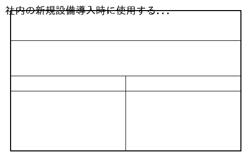

- **Query**: 社内の新規設備導入時に使用する稟議申請書のテンプレート。
- **Positive Description**: 社内で新しいIT機器やソフトウェアを導入する際に承認を得るための、標準的な稟議申請書のテンプレートフォーマット。
- **Hard Negative Description**: 有給休暇の取得申請書フォーマット。新規設備導入のための稟議書ではないため今回の検索要件には合致しない。

---

### ID: document_layouts_05 (document_layouts)
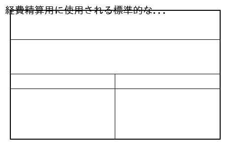

- **Query**: 経費精算用に使用される標準的な領収書のフォーマット。
- **Positive Description**: 会社の経費精算において必要となる、金額、宛名、但し書き、および発行日を記載するための領収書フォーマット。
- **Hard Negative Description**: 商品の納品時に添付される納品書の控え。金額の受領を証明する領収書としての機能を持たないため不適当である。

---

### ID: document_layouts_06 (document_layouts)
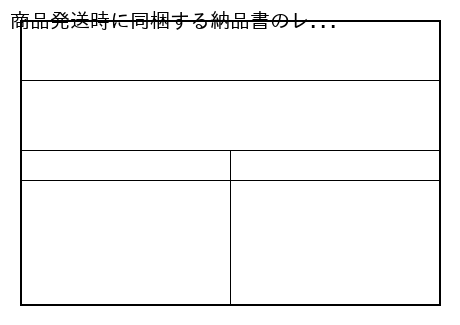

- **Query**: 商品発送時に同梱する納品書のレイアウトサンプル。
- **Positive Description**: 顧客へ商品を発送する際に同梱される、商品名、数量、納品日などが詳細に記載された納品書のレイアウトサンプル。
- **Hard Negative Description**: 商品の製造工程を記録した作業指示書。顧客への納品を証明する書類ではないため今回の検索要件には合致しない。

---

### ID: document_layouts_07 (document_layouts)
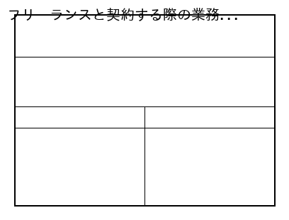

- **Query**: フリーランスと契約する際の業務委託契約書のひな形。
- **Positive Description**: 外部のフリーランスエンジニアやデザイナーと業務を委託する際に締結するための、業務委託契約書の標準的なひな形。
- **Hard Negative Description**: 正社員の雇用条件を定めた雇用契約書。業務委託に関する条項が含まれていないため検索意図から外れている。

---

### ID: document_layouts_08 (document_layouts)
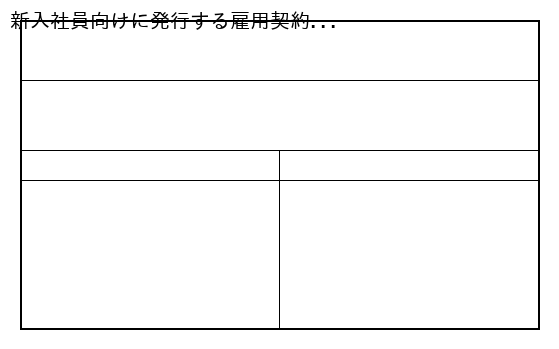

- **Query**: 新入社員向けに発行する雇用契約書の標準テンプレート。
- **Positive Description**: 新しく採用した正社員に対して交付する、給与や労働時間などの労働条件が詳細に記載された雇用契約書のテンプレート。
- **Hard Negative Description**: 外部業者との取引基本契約書。社員の雇用に関する労働条件が記載されていないため今回の要件には合致しない。

---

### ID: document_layouts_09 (document_layouts)
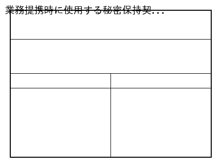

- **Query**: 業務提携時に使用する秘密保持契約書（NDA）の全体レイアウト。
- **Positive Description**: 他社との業務提携を検討する際に、相互に機密情報を保護するために締結する秘密保持契約書の全体レイアウト。
- **Hard Negative Description**: 社内の情報セキュリティポリシー規定書。他社と締結する契約書としての体裁を備えていないため不適当である。

---

### ID: document_layouts_10 (document_layouts)
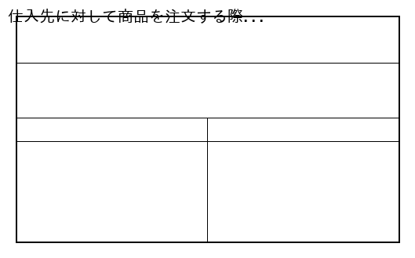

- **Query**: 仕入先に対して商品を注文する際の発注書フォーマット。
- **Positive Description**: 取引先や仕入先に対して、必要な資材や商品の品名、数量、希望納期を指定して注文するための発注書フォーマット。
- **Hard Negative Description**: 仕入先から受け取った見積書のPDFファイル。こちらから発注を行うための書類ではないため検索要件を満たさない。

---

### ID: document_layouts_11 (document_layouts)
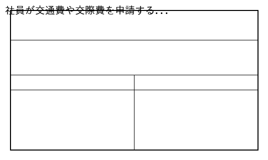

- **Query**: 社員が交通費や交際費を申請する経費精算書のレイアウト。
- **Positive Description**: 従業員が業務で立て替えた交通費や会議費、交際費などを会社に請求・精算するための経費精算書のレイアウト。
- **Hard Negative Description**: 出張の計画を記載した出張稟議書。精算金額の詳細や領収書の貼付欄がないため今回の検索要件には合致しない。

---

### ID: document_layouts_12 (document_layouts)
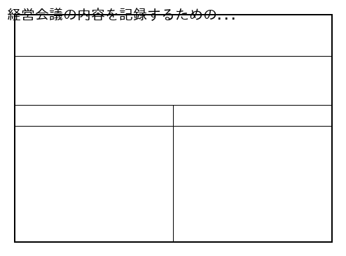

- **Query**: 経営会議の内容を記録するための標準的な議事録フォーマット。
- **Positive Description**: 月例の経営会議において、決定事項や今後の課題、各部門の報告内容を正確に記録するための議事録フォーマット。
- **Hard Negative Description**: 新製品のアイデアを自由に書き留めたブレインストーミングのメモ。公式な議事録のフォーマットではないため不適当。

---

### ID: document_layouts_13 (document_layouts)
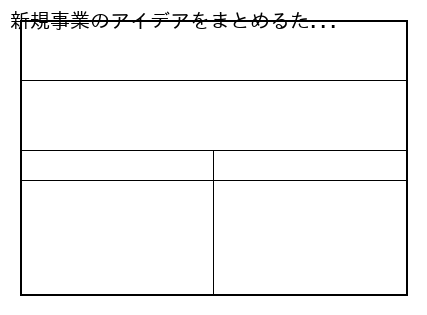

- **Query**: 新規事業のアイデアをまとめるための企画提案書テンプレート。
- **Positive Description**: 社内コンペや役員向けに新規事業のアイデアや市場分析、収益予測を説得力を持ってプレゼンするための企画提案書。
- **Hard Negative Description**: 既存事業の月次運用レポート。新規事業の提案やアイデアをまとめた資料ではないため今回の検索要件には合致しない。

---

### ID: document_layouts_14 (document_layouts)
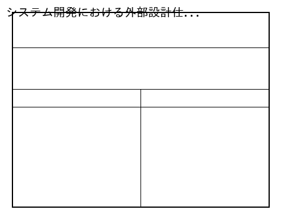

- **Query**: システム開発における外部設計仕様書のドキュメントレイアウト。
- **Positive Description**: システム開発プロジェクトにおいて、画面レイアウトや機能要件、データ定義などを詳細に記載した外部設計仕様書。
- **Hard Negative Description**: システムの操作方法をユーザー向けに解説したマニュアル。開発者向けの設計仕様書ではないため検索意図から外れる。

---

### ID: document_layouts_15 (document_layouts)
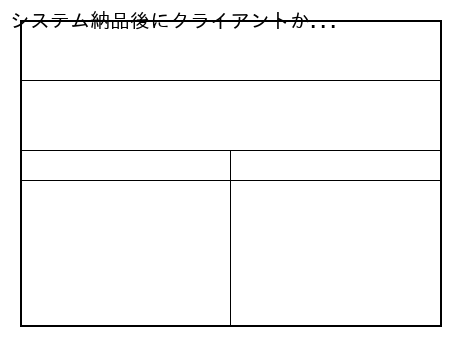

- **Query**: システム納品後にクライアントから受領する検収書のフォーマット。
- **Positive Description**: 開発したシステムの納品後、クライアント側でのテスト完了および受け入れを証明してもらうための検収書フォーマット。
- **Hard Negative Description**: 開発着手前に取り交わす要件定義書の合意書。納品後の検収を証明する書類ではないため今回の要件には合致しない。

---

### ID: ui_system_screens_01 (ui_system_screens)
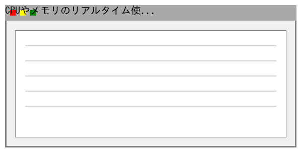

- **Query**: CPUやメモリのリアルタイム使用率を表示する監視画面。
- **Positive Description**: 運用中のサーバー群におけるCPU使用率、メモリ消費量、ネットワークトラフィックをリアルタイムで表示する監視画面。
- **Hard Negative Description**: 過去1年間のサーバー稼働率をまとめた静的な月次レポートPDF。リアルタイムの監視画面ではないため要件を満たさない。

---

### ID: ui_system_screens_02 (ui_system_screens)
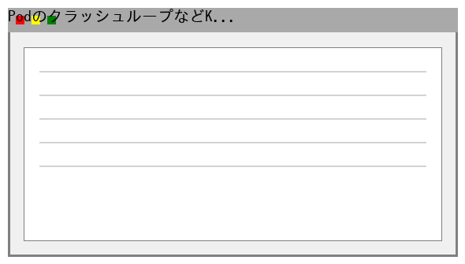

- **Query**: PodのクラッシュループなどKubernetesのエラーログ画面。
- **Positive Description**: Kubernetesクラスター上で発生しているPodのCrashLoopBackOffやOOMKilledなどの詳細なエラーログを表示する画面。
- **Hard Negative Description**: アプリケーションの正常なアクセスログを一覧表示した画面。Kubernetes特有のエラー情報が含まれていないため不適当。

---

### ID: ui_system_screens_03 (ui_system_screens)
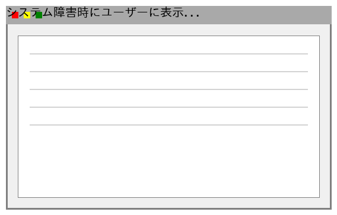

- **Query**: システム障害時にユーザーに表示される500エラー画面。
- **Positive Description**: サーバー内部で予期せぬ重大な障害が発生した際に、一般ユーザーのブラウザ上に表示される500 Internal Server Error画面。
- **Hard Negative Description**: ページが見つからない場合に表示される404 Not Found画面。サーバー内部のエラーを示す画面ではないため検索要件に合致しない。

---

### ID: ui_system_screens_04 (ui_system_screens)
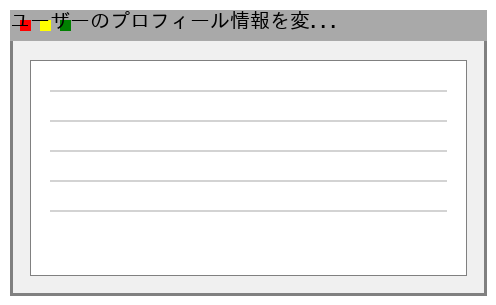

- **Query**: ユーザーのプロフィール情報を変更するための設定モーダルウィンドウ。
- **Positive Description**: Webアプリケーション内で、ユーザーが自身の表示名やアイコン画像、通知設定などを変更できる設定モーダルウィンドウ。
- **Hard Negative Description**: 全画面で表示される長文の利用規約ページ。モーダルウィンドウ形式の設定画面ではないため今回の検索要件には合致しない。

---

### ID: ui_system_screens_05 (ui_system_screens)
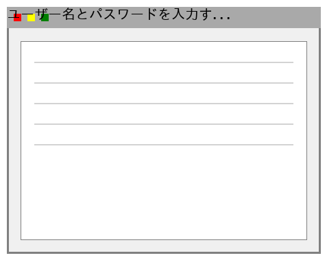

- **Query**: ユーザー名とパスワードを入力するシステムのログイン画面。
- **Positive Description**: 企業の社内システムにアクセスするため、従業員ID（ユーザー名）とパスワードを入力する標準的なログイン画面のUI。
- **Hard Negative Description**: ログイン後に表示されるホームダッシュボード画面。認証情報を入力するログイン画面自体ではないため検索意図から外れる。

---

### ID: ui_system_screens_06 (ui_system_screens)

- **Query**: システム管理者が登録ユーザーを一覧で確認できる画面。
- **Positive Description**: システム管理者が、システムに登録されている全ユーザーのアカウント状態や最終ログイン日時を一覧で確認・管理できる画面。
- **Hard Negative Description**: 一般ユーザーが自身の情報のみを確認できるマイページ。管理者向けのユーザー一覧管理機能がないため今回の要件を満たさない。

---

### ID: ui_system_screens_07 (ui_system_screens)
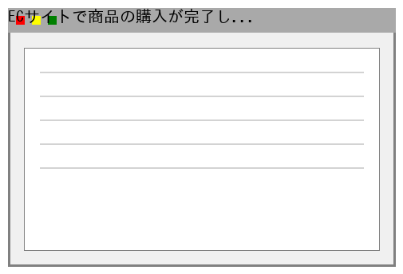

- **Query**: ECサイトで商品の購入が完了した直後に表示される画面。
- **Positive Description**: オンラインショッピングサイトにおいて、クレジットカード決済が正常に処理され、注文番号やサンクスメッセージが表示される決済完了画面。
- **Hard Negative Description**: 商品をカートに入れた直後に表示されるカート確認画面。決済処理がまだ完了していないため今回の検索要件には合致しない。

---

### ID: ui_system_screens_08 (ui_system_screens)
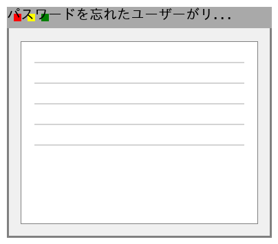

- **Query**: パスワードを忘れたユーザーがリセット用リンクを要求する画面。
- **Positive Description**: ログインパスワードを忘却したユーザーが、登録済みのメールアドレスを入力してパスワードリセット用のリンク送信を要求する画面。
- **Hard Negative Description**: 新しいパスワードと確認用パスワードを入力して登録を完了する画面。リセットを要求する最初の画面ではないため不適当である。

---

### ID: ui_system_screens_09 (ui_system_screens)

- **Query**: キーワード検索後に該当する商品や記事が一覧表示される画面。
- **Positive Description**: サイト内の検索ボックスからキーワードを入力した結果として、関連する商品データや記事のサムネイルがリスト形式で一覧表示される画面。
- **Hard Negative Description**: 検索キーワードを入力するためのトップページの検索フォーム画面。検索を実行した後の結果一覧ではないため検索要件に合致しない。

---

### ID: ui_system_screens_10 (ui_system_screens)
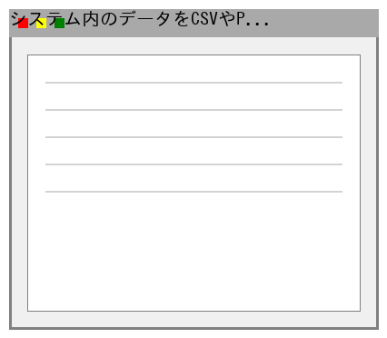

- **Query**: システム内のデータをCSVやPDFで出力する際の設定画面。
- **Positive Description**: システムに蓄積されたレポートデータをCSVやPDF形式でダウンロードする前に、出力期間や項目を詳細に選択できるデータエクスポート設定画面。
- **Hard Negative Description**: データをシステムに取り込むためのCSVインポート画面。データを出力（エクスポート）するための画面ではないため検索意図から外れる。

---

### ID: ui_system_screens_11 (ui_system_screens)
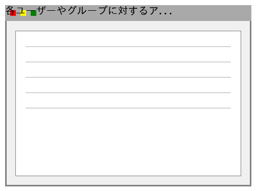

- **Query**: 各ユーザーやグループに対するアクセス権限を設定する画面。
- **Positive Description**: システム管理者が、特定のユーザーやロール（グループ）に対して各機能へのアクセス権や編集権限を詳細に割り当てるための権限管理画面。
- **Hard Negative Description**: ユーザーの基本情報（氏名や部署名）のみを編集する画面。アクセス権限の詳細な設定機能が含まれていないため要件を満たさない。

---

### ID: ui_system_screens_12 (ui_system_screens)
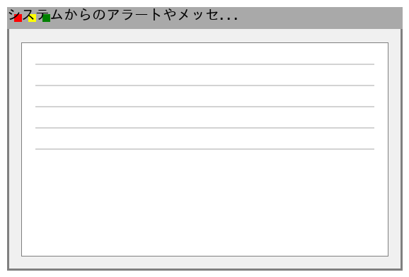

- **Query**: システムからのアラートやメッセージを一覧表示する通知パネル。
- **Positive Description**: ヘッダーのベルアイコンをクリックした際にドロップダウンで表示される、システムからの最新のアラートや運営からのメッセージの一覧通知パネル。
- **Hard Negative Description**: 個別の通知の詳細内容を全画面で表示する画面。複数のお知らせを一覧で確認できるパネルUIではないため今回の検索要件には合致しない。

---

### ID: ui_system_screens_13 (ui_system_screens)
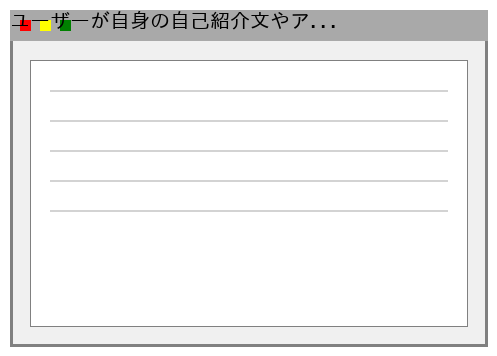

- **Query**: ユーザーが自身の自己紹介文やアバター画像を変更する画面。
- **Positive Description**: 一般ユーザーがログイン後に自身のマイページからアクセスし、自己紹介文の更新や新しいアバター画像をアップロードできるプロフィール編集画面。
- **Hard Negative Description**: 他のユーザーの公開プロフィールを閲覧するだけの画面。自身の情報を編集・変更する機能が含まれていないため検索意図から外れている。

---

### ID: ui_system_screens_14 (ui_system_screens)
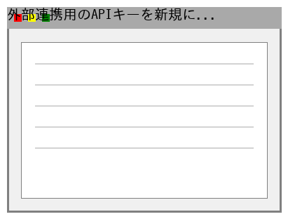

- **Query**: 外部連携用のAPIキーを新規に発行・管理するための画面。
- **Positive Description**: 開発者向けの管理コンソールにおいて、外部アプリケーションと連携するための新しいAPIキーの生成や既存キーの無効化を行うための管理画面。
- **Hard Negative Description**: APIの仕様やエンドポイントを解説したドキュメントページ。APIキーを実際に生成・管理するシステム画面ではないため要件を満たさない。

---

### ID: ui_system_screens_15 (ui_system_screens)
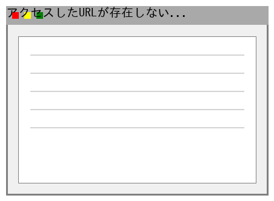

- **Query**: アクセスしたURLが存在しない場合に表示される404エラー画面。
- **Positive Description**: ユーザーが誤ったURLを入力した、あるいはページが削除された場合に、「ページが見つかりません」というメッセージとともに表示される404エラー画面。
- **Hard Negative Description**: サーバーの一時的な過負荷で表示される503 Service Unavailable画面。ページが存在しないことを示す404エラーではないため不適当である。

---

### ID: technical_diagrams_01 (technical_diagrams)
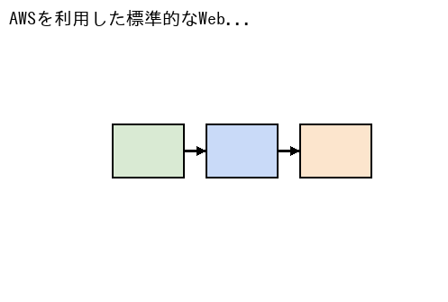

- **Query**: AWSを利用した標準的なWeb3層アーキテクチャの構成図。
- **Positive Description**: AWS上で構築された、ALBによる負荷分散、ECSでのコンテナ実行、およびRDSを用いたデータストアからなる標準的なWeb3層のクラウドアーキテクチャ構成図。
- **Hard Negative Description**: オンプレミスの物理サーバーラックの配置を示した図面。AWSなどのクラウドアーキテクチャの構成図ではないため検索要件には合致しない。

---

### ID: technical_diagrams_02 (technical_diagrams)
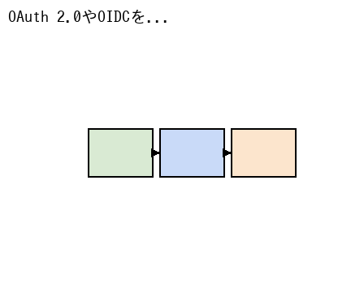

- **Query**: OAuth 2.0やOIDCを用いたユーザー認証のフローを示すシーケンス図。
- **Positive Description**: クライアントアプリケーション、認可サーバー、およびリソースサーバー間でのOAuth 2.0を用いたトークン発行からユーザー認証までのフローを示すシーケンス図。
- **Hard Negative Description**: データベースのテーブル間のリレーションを示したER図。認証プロセスの時系列なフローを示すシーケンス図ではないため不適当である。

---

### ID: technical_diagrams_03 (technical_diagrams)
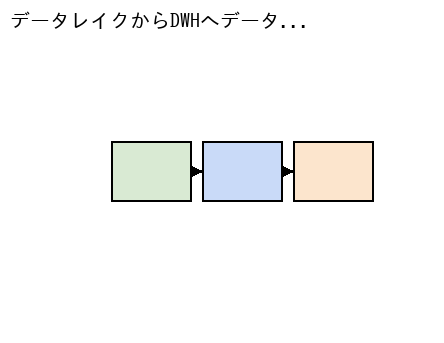

- **Query**: データレイクからDWHへデータをETL処理するパイプラインのフロー図。
- **Positive Description**: Amazon S3のデータレイクから抽出・変換（ETL）処理を行い、Amazon RedshiftなどのDWHにデータをロードするまでの一連のデータパイプラインフロー図。
- **Hard Negative Description**: Webアプリケーションの画面遷移を示したUIフロー図。データのバッチ処理やETLに関するパイプライン図ではないため今回の要件には合致しない。

---

### ID: technical_diagrams_04 (technical_diagrams)
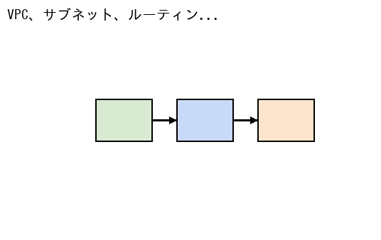

- **Query**: VPC、サブネット、ルーティングを詳細に記述したネットワーク図。
- **Positive Description**: 本番環境におけるVPCの分割、パブリック/プライベートサブネットの配置、NATゲートウェイおよびルーティングテーブルの設定を詳細に記述したネットワーク構成図。
- **Hard Negative Description**: 社内の座席表とオフィスの見取り図。ITインフラストラクチャのネットワーク構成を示す図ではないため検索意図から外れている。

---

### ID: technical_diagrams_05 (technical_diagrams)
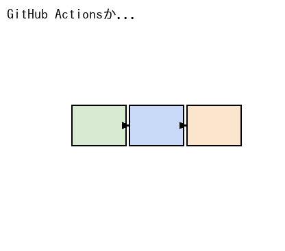

- **Query**: GitHub Actionsからデプロイまでの自動化CI/CDパイプライン図。
- **Positive Description**: コードのプッシュをトリガーとして、GitHub Actionsによる自動テストの実行、コンテナイメージのビルド、および本番環境への自動デプロイまでのCI/CDパイプライン図。
- **Hard Negative Description**: システム開発のスケジュールを管理するガントチャート。ビルドやデプロイの自動化パイプラインの構成を示す図ではないため要件を満たさない。

---

### ID: technical_diagrams_06 (technical_diagrams)
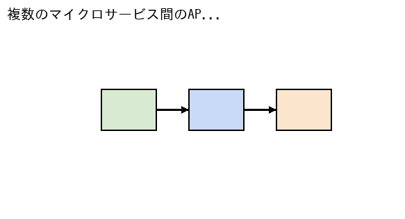

- **Query**: 複数のマイクロサービス間のAPI通信と依存関係を示す図。
- **Positive Description**: ECサイトの裏側で稼働する、注文サービス、決済サービス、在庫サービスといった複数のマイクロサービス間のAPI呼び出しフローと依存関係を示すアーキテクチャ連携図。
- **Hard Negative Description**: 単一のモノリシックアプリケーション内部のクラス構造図。複数の独立したサービス間の連携を示す図ではないため今回の検索要件には合致しない。

---

### ID: technical_diagrams_07 (technical_diagrams)
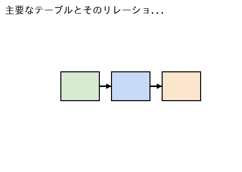

- **Query**: 主要なテーブルとそのリレーションシップ（1対多など）を示すER図。
- **Positive Description**: 顧客テーブル、注文テーブル、商品テーブルなどの主要なデータベーステーブルの構造と、それらの間の1対多などのリレーションシップを詳細に示したER図。
- **Hard Negative Description**: システムのユースケースとアクタの関係を示したユースケース図。データベースの構造やテーブル間の関係を示す図ではないため不適当である。

---

### ID: technical_diagrams_08 (technical_diagrams)

- **Query**: 注文のステータス（受付➔処理中➔発送済）の遷移を示す状態遷移図。
- **Positive Description**: ECシステムにおける注文データのステータスが、「注文受付」「決済処理中」「発送準備中」「発送完了」へとどのように遷移するかを定義した状態遷移図（ステートマシン図）。
- **Hard Negative Description**: 処理の分岐やループを記述したフローチャート。特定のオブジェクトのライフサイクルや状態の遷移に焦点を当てた図ではないため検索意図から外れる。

---

### ID: technical_diagrams_09 (technical_diagrams)

- **Query**: 夜間に実行される日次集計バッチの処理手順と依存関係を示す図。
- **Positive Description**: 毎晩深夜に実行される売上データの日次集計バッチについて、データの抽出、集計処理、およびレポート生成までの処理手順とジョブの依存関係を示すフロー図。
- **Hard Negative Description**: リアルタイムで処理されるストリーミングデータのパイプライン図。夜間に定期実行されるバッチ処理のフローではないため今回の要件には合致しない。

---

### ID: technical_diagrams_10 (technical_diagrams)

- **Query**: 新規ユーザーがアカウントを作成する際の一連のシステム間通信を示す図。
- **Positive Description**: 新規ユーザーが登録フォームを送信してから、入力値バリデーション、DBへの保存、そして確認メールが送信されるまでのシステム間通信を時系列で示すシーケンス図。
- **Hard Negative Description**: ユーザー登録画面のワイヤーフレームレイアウト。システム内部の通信や処理の順序を示すシーケンス図ではないため検索要件を満たさない。

---

### ID: technical_diagrams_11 (technical_diagrams)

- **Query**: システムの主要なクラスとその属性、メソッド、継承関係を示す図。
- **Positive Description**: オブジェクト指向設計に基づいて、システムの主要なクラス（User, Order, Product等）の持つ属性やメソッド、およびクラス間の継承・集約関係をUMLで記述したクラス図。
- **Hard Negative Description**: ネットワーク機器の物理的な結線を示す物理構成図。ソフトウェアのオブジェクト指向設計に関するクラス図ではないため今回の検索要件には合致しない。

---

### ID: technical_diagrams_12 (technical_diagrams)

- **Query**: RabbitMQやKafkaを用いた非同期メッセージ処理の構成図。
- **Positive Description**: システムの負荷を平準化するために、RabbitMQやApache Kafkaなどのメッセージキューを用いてプロデューサーからコンシューマーへ非同期でタスクを渡す処理の構成図。
- **Hard Negative Description**: REST APIを用いた同期的なリクエスト・レスポンス通信の図。メッセージキューを利用した非同期処理のアーキテクチャではないため不適当である。

---

### ID: technical_diagrams_13 (technical_diagrams)

- **Query**: メインリージョンからDRリージョンへのフェイルオーバー構成を示す図。
- **Positive Description**: 災害発生時に備えて、メインリージョン（東京）からスタンバイリージョン（大阪）へのデータベースのレプリケーションと、DNSによるフェイルオーバーの仕組みを示すDR構成図。
- **Hard Negative Description**: 通常の負荷分散のみを目的とした単一リージョン内のマルチAZ構成図。別リージョンへの障害復旧（DR）を想定した構成ではないため検索意図から外れる。

---

### ID: technical_diagrams_14 (technical_diagrams)

- **Query**: Fluentd ➔ Elasticsearch ➔ Kibanaなどのログ収集・分析基盤の図。
- **Positive Description**: 各アプリケーションサーバーからFluentdを用いてログを収集し、Elasticsearchに蓄積してKibanaで可視化する（EFKスタック）というログ収集・分析基盤のアーキテクチャ図。
- **Hard Negative Description**: アクセス解析ツールのGoogle Analyticsのダッシュボード画面。システム内部のログ収集や分析基盤のアーキテクチャ構成図ではないため要件を満たさない。

---

### ID: technical_diagrams_15 (technical_diagrams)

- **Query**: 多数のエッジデバイスからクラウドへセンサーデータを送信するフロー図。
- **Positive Description**: 工場内に設置された多数のIoTセンサーデバイスから、MQTTプロトコルを使用してAWS IoT Coreへ継続的に環境データを送信・収集する一連のシステムフロー図。
- **Hard Negative Description**: 企業の基幹システムにおける人事データの更新フロー図。IoTデバイスやセンサーからのデータ収集に関するフローではないため今回の検索要件には合致しない。

---

